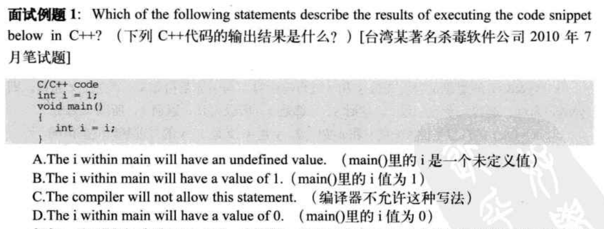
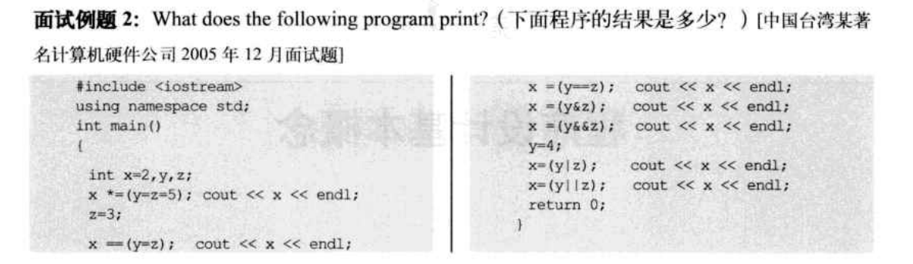
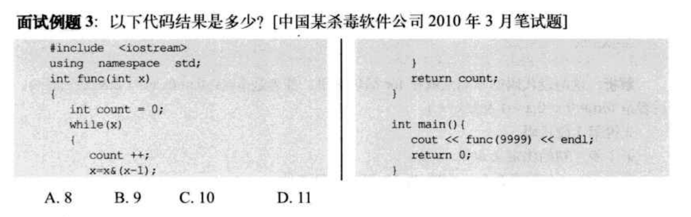
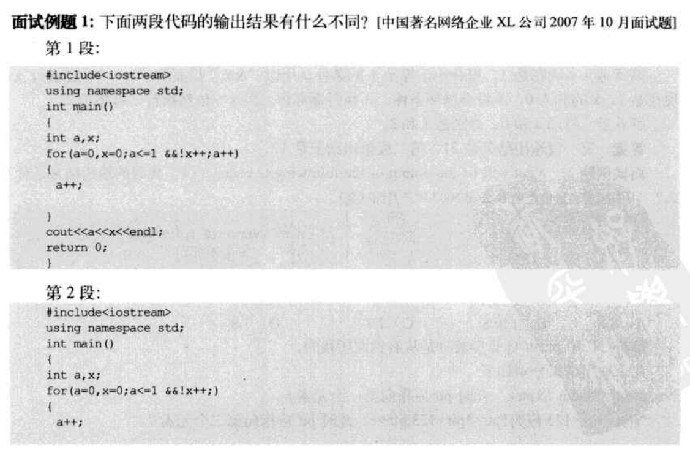
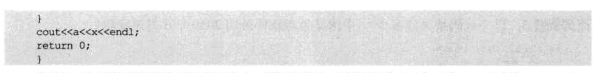
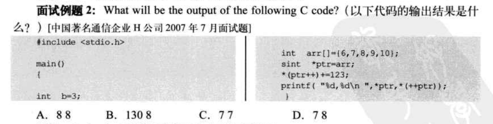
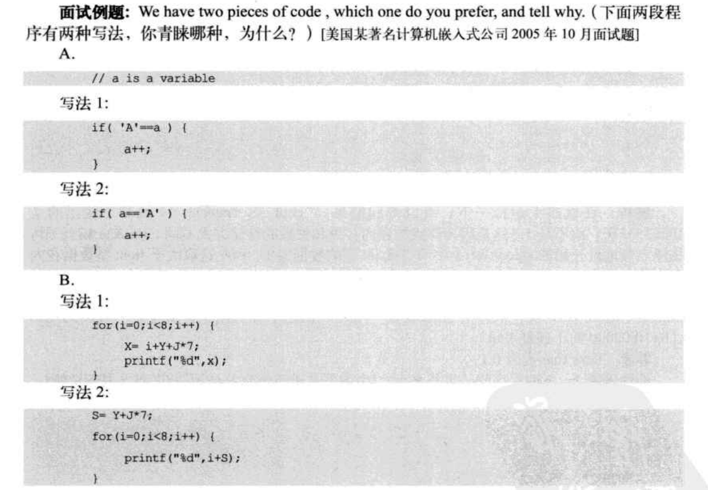
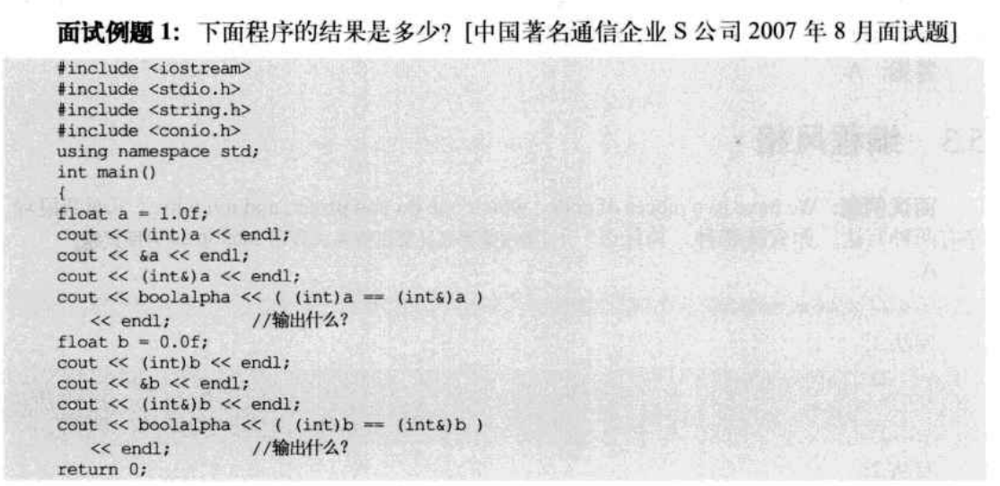

# 5.1 赋值语句

## 例题一



## 例题二



+ `x*=(y=z=5)`:
  + `y=5`、`z=5`
  + `x=2*5=10`
+ `x==(y=z)`
  + `z=3`，`y=z`，`y=3`
  + `==`是逻辑运算符，不是赋值语句，`x`值不变
  + `x=10`
+ `x=(y==z)`
  + `y==z`是表达式，值为1
  + `x=1`
+ `x=(y&z)`
  + `y=3`，`z=3`
  + `y&z`：`y`与`z`按位与，因为`y==z`，所以`y&z`的结果为`y`
  + `x=y=3`
+ `x=(y&&z)`
  + `y&&z`：`y`和`z`与运算，双方都为真，值为1
  + `x=1`
+ `x=(y|z)`
  + `y=4`，`y=0100`，`z=3`，`z=0011`
  + `y|z`：y与z按位或，每位不同为1，相同为0，值为0111
  + `x=0111`，`x=7`
+ `x=(y||z)`
  + `y||z`：y与z或运算，任何一个为真，值为1
  + `x=1`

答案为：10,10,1,3,1,7,1

## 例题三



`9999=10011100001111` 

```xml
2 4999 1
2 2499 1
2 1249 1
2 0624 1
2 0312 0
2 0156 0
2 0078 0
2 0039 0
2 0019 1
2 0009 1
2 0004 1
2 0002 0
2 0001 0
2 0000 1
10011100001111
```

显而易见，这个代码题是看x循环到零需要几次运算

x的状态变换代码为`x=x&(x-1)`

`&`运算，对两边的变量按位与，只有两个变量对应位上都为1，值才为1

第一轮时，`x = 10011100001111`，`x-1 = 10011100001110`

所以`x = x&(x-1) = 10011100001110`

然后之后，每次x做减一操作都会改变原有的最后一个1的位置，然后每一轮都有一个1变成0

x有8位1，所以需要经过8次循环，变成0

此时`count = 8`

# 5.2 i++

## 例题1





+ 第一段
  1. a=0，x=0
  2. 判断：`a<=1 && !x++`
     + a<=1值为1
     + x=0，!x++值为1
     + x=1
  3. 中间循环体：a++
     + a = 1
  4. 末尾循环体：a++
     + a = 2
  5. 判断：`a<=1 && !x++`
     + a = 2，a<=1值为0
     + **==a<=1已经值为0，所以&&后的表达式不再执行==**
  6. 输出：
     + a=2，x=1
     + 输出为21
+ 第二段
  1. a=0，x=0
  2. 判断：`a<=1 && !x++`
     + a=0，a<=1值为1
     + x=0，!x++值为1
     + x=1
  3. 中间循环体：a++
     + a = 1
  4. 判断：`a<=1 && !x++`
     + a = 1，a<=1值为1
     + x=1，!x++值为0
     + x=2
  5. 输出：
     + a=1，x=2
     + 输出为：12



+ `*ptr = arr*`：`*ptr = 6`
+ `*(ptr++)+=123`：
  + `*ptr+=123`：`*ptr = 6+123 = 129`
  + `*(Ptr++)`：`*ptr = 7`
+ `printf("%d,%d\n",*ptr,*(++ptr))`
  + ==**c++中`printf`中的表达式是从右往左运算的**==
  + `*(++ptr)`：`*ptr = 8`
  + `*ptr*`：`*ptr = 8`

输出结果为8，8

# 5.3 编程风格

## 例题一



A：写法一

因为如果`==`少写一个`=`，就会变成赋值

如果是写法二，会将`'A'`赋值给变量`a`

如果是写法一，程序会报错

B：写法二

将变量的计算放到了循环体外面，提高了效率，缺点是代码不够简洁

# 5.4 类型转换

