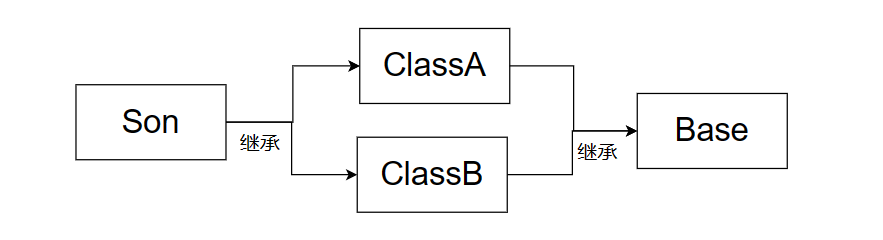
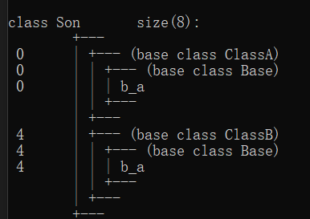
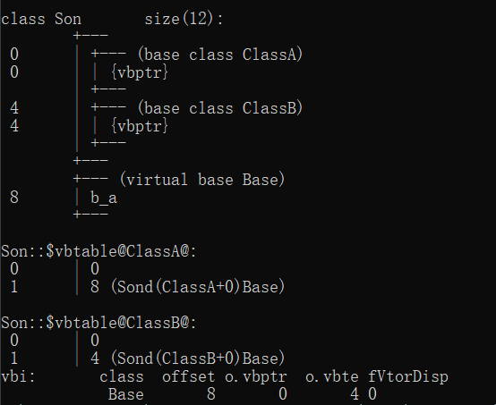
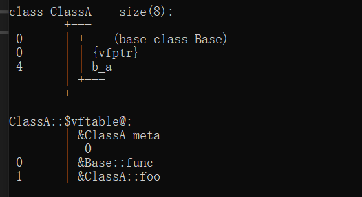
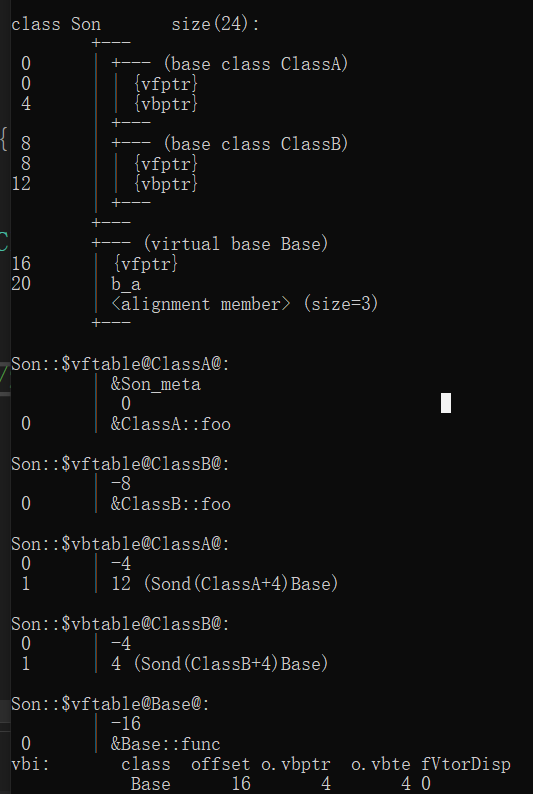

## 7 菱形继承问题

### **问题1：菱形继承重复的成员变量**

菱形继承是如图所示的继承情况



**菱形继承是某一个派生类多继承的基类，又继承同一基类的情况**

```c++
#include<iostream>
using namespace std;

class Base {
public:
	int b_a;
};
class ClassA : public Base {};
class ClassB : public Base{};
class Son : public ClassA,public ClassB{};

int main() {

	cout << sizeof(Son) << endl;//8
	return 0;
}
```

Son类的对象模型：



> 如上所示：Son类继承了`ClassA`和`ClassB`类，而`ClassA`和`ClassB`类继承了Base类
>
> 如果Base类中存在成员变量，比如temp，可想而知，在Son类中会从`ClassA`和`ClassB`类中继承得到两个相同名称的成员
>
> 固然，我们可以使用为成员添加作用域的方式去访问我们想访问的成员
>
> 但有几点不便：
>
> 1. Son中只需要一个成员，多个同名成员会导致逻辑上的混乱
> 2. 额外的成员需要额外的存储空间，造成空间的浪费

解决方案：**使用虚继承的方式**

```c++
#include<iostream>
using namespace std;

class Base {
public:
	char b_a;
};
class ClassA :virtual public Base {};
class ClassB :virtual public Base{};
class Son :public ClassA,public ClassB{};

int main() {

	cout << sizeof(Son) << endl;//12
	return 0;
}
```

 


### 问题2：虚继承解决菱形继承的底层机制

```c++
#include<iostream>
using namespace std;

class Base {
public:
	int b_a;
};
class ClassA :virtual public Base {
};
class ClassB :virtual public Base{
};
class Son :public ClassA, public ClassB {

};
int main() {
	Son s;
	s.b_a = 1;
	cout << "使用Son对象的b_a修改后：" << s.b_a << endl;
	s.ClassA::b_a = 2;
	cout << "使用Son对象继承的ClassA作用域内的b_a修改后：" << s.b_a << endl;
	s.ClassB::b_a = 3;
	cout << "使用Son对象继承的ClassB作用域内的b_a修改后：" << s.b_a << endl;
	s.ClassA::Base::b_a = 4;
	cout << "使用Son对象继承的ClassA继承的Base作用域内的b_a修改后：" << s.b_a << endl;
	s.ClassB::Base::b_a = 5;
	cout << "使用Son对象继承的ClassB继承的Base作用域内的b_a修改后：" << s.b_a << endl;
	cout << sizeof(Son) << endl;//12
	return 0;
}
```

如上图`ClassA`与`ClassB`的对象模型

在普通继承下，编译器会将父类的非静态成员变量拷贝进子类的内存空间中，所以`ClassA`和`ClassB`中，会各自存储一份父类成员变量的拷贝，所以在`Son`中，会出现两份名称一样的父类成员

而在虚继承的情况下 ，编译器不会将父类非静态成员变量拷贝一份，而是在子类的内存空间中存放了一个指向父类内存空间的指针，当需要访问从父类继承的成员时，就通过指针，查找虚基类表，根据偏移量找到父类内存空间中对应成员进行访问。

所以继承了`ClassA`和`ClassB`的`Son`中存在两个虚基类指针，一个是`ClassA`指向父类内存空间的指针，一个是`ClassB`指向父类内存空间的指针。也就是说，在`Son`对象中，通过`ClassA`命名空间、通过`ClassB`命名空间、通过`ClassA`命名空间中的`Base`命名空间和通过`ClassB`命名空间中的`Base`命名空间操作的同名成员是**同一个成员**

同时，我们必须注意到，**虚继承的方式，只影响虚基类的派生类到虚基类派生类的派生类之间的继承关系**，也就是`ClassA`和`ClassB`到`Son`的继承关系。

也就是说，**虚继承的目的就是消除多继承产生的同名成员歧义**

### **问题3：类占内存空间大小计算**

> 当类中存在虚函数时，类就会产生一个虚函数表，也就需要一个**指向虚函数表指针**
>
> 当类是虚继承时，就需要产生一个**指向虚类指针**
>
> (**指针大小，32位系统中4个字节，64位系统中8个字节**)
>
> 内存对齐，计算内存空间时，单个内存块会按照最大独立单元大小分配

```c++
#include<iostream>
using namespace std;

class Base {
	virtual void func();
	char b_a;
};
class ClassA :public Base {
	virtual void foo();
};
class ClassB :virtual public Base{
	virtual void foo();
};

int main() {
	cout << sizeof(ClassA) << endl;//8
	cout << sizeof(ClassB) << endl; //16
	return 0;
}
```

**`ClassA`的内存计算**

`ClassA`公共继承Base，所以，在计算`ClassA`的内存大小时，可以直接将Base内非静态成员放到`ClassA`中进行计算

也就相当于，`ClassA`类中有两个虚成员函数和一个char数据类型成员变量

两个虚函数存放在一个虚函数表，需要一个虚函数指针

也就是，`ClassA`的内存大小等于一个虚函数表指针加上一个char成员变量

假设是32位环境，一个指针需要4个字节，一个char需要1个字节，内存对齐，补充3个字节，最终`ClassA`类的内存大小为 $2*4 = 8$ 个字节

`ClassA`的对象模型：



**`ClassB`的内存计算**：

`ClassB`虚继承Base类，`ClassB`存在一个虚基类表，也就需要一个虚基类指针，也就是4个字节

`ClassB`类中存在一个虚函数，需要一个虚表指针，4个字节

`Base`类中存在一个虚函数，需要一个虚表指针，4个字节

`ClassB`类中存在一个char成员变量，占1个字节，补充3个字节

所以，`ClassB`的内存大小为 $4*4 = 16$ 个字节大小

`ClassB`的对象模型：


**使用虚继承后菱形继承`Son`类的内存大小计算**

```c++
#include<iostream>
using namespace std;

class Base {
	virtual void func();
	char b_a;
};
class ClassA :virtual public Base {
	virtual void foo();
};
class ClassB :virtual public Base{
	virtual void foo();
};
class Son :public ClassA, public ClassB {

};
int main() {
	cout << sizeof(Son) << endl;//24
	return 0;
}
```

`ClassA`和`ClassB`虚继承`Base`，`Son`公共继承`ClassA`和`ClassB`

`Son`普通继承了`ClassA`和`ClassB`，也就相当于将`ClassA`和`ClassB`中的非静态成员变量拷贝到`Son`中

`ClassA`存在一个指向`Base`的虚基类指针和一个虚表指针

`ClassB`中存在一个指向`Base`的虚基类指针和一个虚表指针

也就是说，现在Son中要存在俩个指向`Base`的虚基类指针和两个虚表指针，也就是16个字节

`Base`中存在一个虚表指针和一个`char`类型数据，内存为8个字节

所以`sizeof(Son)`的结果应该为 12 + 8 = 24 字节

**Son的对象模型：**



### 问题4：间接虚基类中重写从虚基类继承下来的成员会造成什么影响？

**只有一条继承路线上重写**

```c++
#include<iostream>
using namespace std;

class Base {
public:
	int b_a;
};
class ClassA :virtual public Base {
public:
	int b_a;
};
class ClassB :virtual public Base{
};
class Son :public ClassA, public ClassB {

};
int main() {
	Son s;
	s.b_a = 1;
	cout << "s直接访问b_a:" << endl;
	cout << "使用Son对象的b_a修改后：" << s.b_a << endl;//1
	s.ClassA::b_a = 2;
	cout << "使用Son对象继承的ClassA作用域内的b_a修改后：" << s.b_a << endl;//2
	s.ClassB::b_a = 3;
	cout << "使用Son对象继承的ClassB作用域内的b_a修改后：" << s.b_a << endl;//2
	s.ClassA::Base::b_a = 4;
	cout << "使用Son对象继承的ClassA继承的Base作用域内的b_a修改后：" << s.b_a << endl;//2
	s.ClassB::Base::b_a = 5;
	cout << "使用Son对象继承的ClassB继承的Base作用域内的b_a修改后：" << s.b_a << endl;//2
	cout << "------------------------------------------------------" << endl;
	cout << "使用Son对象访问继承的ClassA继承的Base作用域内的b_a：" << s.ClassA::Base::b_a << endl;//5
	cout << "使用Son对象访问继承的ClassB作用域内的b_a：" << s.ClassB::b_a << endl;//5
	cout << "使用Son对象访问继承的ClassB继承的Base作用域内的b_a：" << s.ClassB::Base::b_a << endl;//5
	
	return 0;
}
```

> 结果显而易见：
>
> 1. `s.b_a`，直接访问，访问的是`Son`继承的`ClassA`中重写`b_a`成员
> 2. `ClassA`中重写的成员，隐藏了`Base`中的`b_a`成员
> 3. 仍然可以通过指定命名空间的方式访问到被隐藏的`Base`中的成员
>
> | 访问路线      | 访问方式              | 访问对象               |
> | ------------- | --------------------- | ---------------------- |
> | `Son`直接访问 | `s.b_a`               | `ClassA`覆写的`b_a`    |
> | `ClassA`线    | `s.ClassA::b_a`       | `ClassA`覆写的`b_a`    |
> |               | `s.ClassA::Base::b_a` | 被隐藏的`Base`中的成员 |
> | `ClassB`线    | `s.ClassB::b_a`       | 被隐藏的`Base`中的成员 |
> |               | `s.ClassB::Base::b_a` | 被隐藏的`Base`中的成员 |

**两到多条继承线上重写**

```c++
class Base {
public:
	int b_a;
};
class ClassA :virtual public Base {
public:
	int b_a;
};
class ClassB :virtual public Base{
	int b_a;
};
class Son :public ClassA, public ClassB {

};
#include<iostream>
using namespace std;

class Base {
public:
	int b_a;
};
class ClassA :virtual public Base {
public:
	int b_a;
};
class ClassB :virtual public Base{
public:
	int b_a;
};
class Son :public ClassA, public ClassB {

};
int main() {
	Son s;
	s.ClassA::b_a = 10;
	s.ClassB::b_a = 20;
	s.ClassA::Base::b_a = 30;
	s.ClassB::Base::b_a = 30;
    
    //cout << s.b_a << endl;
	cout << s.ClassB::b_a << endl;//20
	cout << s.ClassA::b_a << endl;//10
	cout << s.ClassA::Base::b_a << endl;//40
	cout << s.ClassB::Base::b_a << endl;//40
    
	return 0;
}
```

> 1. `Son`类对象将无法直接访问`b_a`，必须要加上命名空间才能进行访问
> 2. 间接虚基类重写的成员会隐藏掉其从虚基类继承的成员
> 3. 虚基类中的成员仍只有一份
> 
> | 访问路线      | 访问方式              | 访问对象               |
> | ------------- | --------------------- | ---------------------- |
> | `Son`直接访问 | `s.b_a`               | 二义性，报错           |
> | `ClassA`线    | `s.ClassA::b_a`       | `ClassA`覆写的`b_a`    |
> |               | `s.ClassA::Base::b_a` | 被隐藏的`Base`中的成员 |
> | `ClassB`线    | `s.ClassB::b_a`       | `ClassB`覆写的`b_a`    |
> |               | `s.ClassB::Base::b_a` | 被隐藏的`Base`中的成员 |
