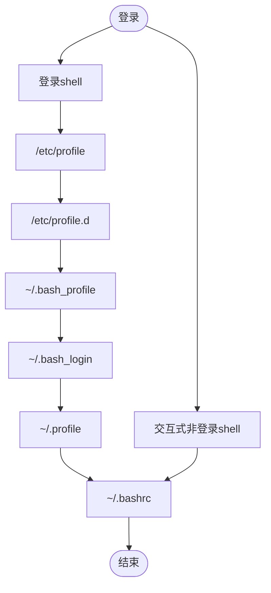

[环境变量手册](https://wiki.archlinuxcn.org/wiki/%E7%8E%AF%E5%A2%83%E5%8F%98%E9%87%8F)

## 1. 工具

`coreutils`软件包包含以下两个工具

+ printenv
+ env

1 printenv

作用: 在终端打印用户对应的环境变量

2 env

作用:

+ 在终端打印用户对应的环境变量
+ 以临时环境变量启动命令

语法:

```shell
env 环境变量 command
```

+ 该环境变量为临时环境变量, 仅作用于此次命令

## 2. 配置目录

系统登录时配置文件加载顺序:



1. 读入全局环境变量设定档`/etc/profile`，然后根据其内容读取额外的设定的文档，如`/etc/profile.d`和`/etc/inputrc`；
2. 根据不同使用者帐号，于其家目录内读取`~/.bash_profile`；
3. 读取失败则会读取`~/.bash_login`；
4. 再次失败则读取`~/.profile`；
5. 最后，根据用户帐号读取`~/.bashrc`

### 2.1. 系统级别

`/etc/profile`

`etc/environment`: 被pam_env模块使用, 与 shell 无关

### 2.2. 用户级别

+ `~/.bash_profile`
+ `~/.bash_login`
+ `~/.profile`

> 三个文档设定基本上无差别，仅读取上有优先关系

+ `~/.config/environment.d/*.conf`: systemd读取

### 2.3. bashrc

+ `/etc/bashrc`: 系统级别
+ `~/.bashrc`: 用户级别

### 2.4. 桌面环境

[桌面环境配置](https://wiki.archlinuxcn.org/wiki/%E6%A1%8C%E9%9D%A2%E9%A1%B9)

## 3. 语法

### 3.1. 3-1 查询环境变量

可以通过`grep`查看指定键的值

```shell
env | grep keyName
```

环境变量的文件是**键值对**结构存在的，可以使用`$`配合键名获取变量值，具体如下：

+ `$键名`：获取变量值
+ `${键名}`：获取变量值，并且更进一步确定键名的边界
+ `${#键名}`：获取变量字符串长度

### 3.2. 3-2 设置环境变量

#### 3.2.1. 3-2-1 临时设置

```shell
export 键=值
```

#### 3.2.2. 3-2-2 持久设置

通过修改配置文件，在配置文件中写入`export key=value`代码行，从而使配置持久生效：

+ 系统级别：`/etc/profile`
+ 用户级别：
	+ `~/.bash_profile`
	+ `~/.bashrc`

使配置文件生效：

+ `source 配置文件`
+ `reboot`
