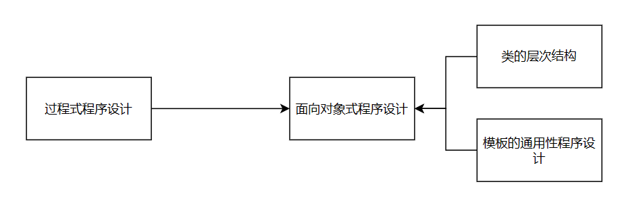

1-3

4-9

10-25

16-22

23-25


# 0. 导论

## 0.1. C++编程规范


**学习C++，最重要的事情是集中关注概念，而不是语言的技术细节中**


**编程应该延续的步骤**：

1. 取得对问题的清晰理解——分析
2. 标识中所涉及解决方案的关键概念——设计
3. 用一个程序表达这个解决方案——编程


**写得出好程序的关键是设计好的类，使他们中的每一个都能清晰表达某个概念**

+ 一个C++类，就是一个类型，刻画这个类的对象的行为：对象的创建、操作与销毁等
+ 这个类的对象应该如何建立？这个类的对象能够被复制/销毁吗？什么操作能够作用于这个对象？
+ 如果对上述问题没有很清晰的答案，**不要立马去围绕那个问题编码，先去思考这个问题和为这个问题设定的解决方案**


**编程时，将相互有关的概念组织到一个树形结构中，使最一般的概念成为树根。**


> **忠告**
>
> 1. 在编程序时，你是在为你针对某个问题的解决方案中的思想建立起一种具体表示。让程序的结构尽可能地直接反映这些思想:
>    1. 如果你能把“它”看成一个独立的概念，就把它做成一个类。
>    2. 如果你能把“它”看成一个独立的实体，就把它做成某个类的一个对象。
>    3. 如果两个类有共同的界面，将此界面做成一个抽象类。
>    4. 如果两个类的实现有某些显著的共同东西，将这些共性做成一个基类。
>    5. 如果一个类是一种对象的容器，将它做成一个模板。
>    6. 如果一个函数实现对某容器的一个算法，将它实现为对一族容器可用的模板函数。
>    7. 如果一组类、模板等互相之间有逻辑联系，将它们放进一个名字空间里。
> 2. 在你定义一个并不是实现某个像矩阵或复数这样的数学对象的类时，或者定义一个低层的类型如链接表的时候:
>    1. 不要使用全局数据(使用成员)。
>    2. 不要使用全局函数。
>    3. 不要使用公用数据成员。
>    4. 不要使用友元，除非为了避免`1.`或`2.`。
>    5.  不要在一个类里面放“类型域”;采用虚函数。
>    6. 不要使用在线函数，除非作为效果显著的优化。


## 0.2. C++ 概览

**概念**：C++是一种通用程序设计的语言，特别是面向系统程序设计，它

+ 是更好的C
+ 支持数据抽象
+ 支持面向对象的程序设计
+ 支持通用性程序设计

**C++支持的程序设计泛型**：



### 0.2.1. 过程式程序设计

**泛型**：
$$
确定你需要哪些过程；
采用你能找到的最好的算法。
$$
关注重点：处理过程——执行预期计算所需要的算法

#### （1） 变量和运算符

​	**语法**：

+ **声明**：`数据类型 变量名;`
+ **赋值**：`变量名 = value；`

>  一个**声明**是为程序引入一个名字，同时为这个名字确定一个类型；**类型**定义了名字或者表达式的正确使用方式。

#### （2） 选择和循环结构

1. `if else`

2. `switch case`

   语法：

   ```c++
   switch(ans){
       case ans1:
           //语句1
       case ans2:
           //语句2
       default:
           //语句3
   }
   ```

   > case对应一个检查的量，这些量必须各不相同

3. `while`

#### （3）指针和数组  

数组声明：`数据类型 数组名[数组长度];`

指针声明：`数据类型 *指针名;`

> 数组名和指针类似，`[]`表示“的数组”，`*`表示"的指针"。

指针可以保留适当元素的地址，比如`p = &v[2];`，`&`是一元取址符

### 0.2.2 模块程序设计

**泛型——数据隐藏原理**：
$$
确定你需要哪些模块;将程序分为一些模块，使数据隐藏于模块之中。
$$
