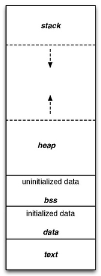

# C++基础知识

## C++ 作用域

C++ 的名称是有作用域的，也就是只有在一定范围内生效

一共有六个作用域：

全局作用域

+ 一个名称定义在任何函数、类、枚举类或命名空间外
+ 声明点到文件结束

局部作用域

+ 声明在函数或lambda函数中
+ 声明点到块结尾

类作用域

+ 类成员的名称，在类中的任何函数、类、枚举类或其他命名空间之外
+ 类的开始到类的结束

函数作用域：

+ 标签(label)具有函数作用域

+ 声明点到函数结束

语句作用域

+ 定义在for-, while-, if-, switch语句的()部分中
+ 声明点开始到语句结束

命令空间作用域

+ 在命名空间内、在任何类或枚举定义或功能块之外声明的名称
+ 声明点到命名空间末尾

## C++内存

# Text\Code