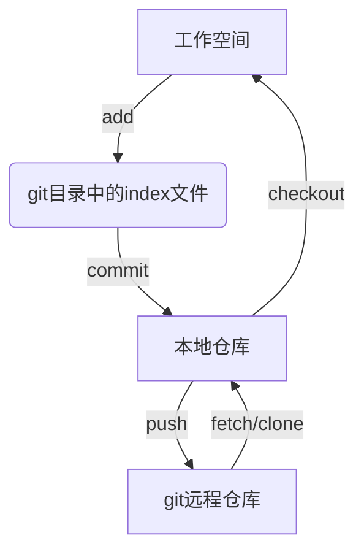

# arch linux 使用git

使用手册： <https://wiki.archlinuxcn.org/wiki/Git#%E9%85%8D%E7%BD%AE>

## 1. 安装

```shell
pacman -S git
```

## 2. 配置

至少配置姓名和邮箱

```shell
git config --global user.name "<用户名>"
git config --global user.email "<邮箱地址>"
```

## 3. 使用流程

流程：



## 4. 使用命令

### 4.1. 创建一个本地版本库

1. 使用`mkdir`命令生成一个文件夹作为git本地仓库
2. `cd`进入仓库
3. 使用`git init`初始化一个git版本库

### 4.2. 下载git文件到本地仓库

```shell
git clone <repository>
```

> 对于在git中已经存储了很多内容的仓库而言，这些仓库创建本地版本库有两种方法：
>
>1. 先构建本地版本库，再连接远程仓库
>
>2. 直接将远程仓库`clone`到本地.

### 4.3. index 操作

1. 更新文件到index

    ```shell
    git add <pathspec>
    ```

    通常 `git add .`

2. 撤销修改

    ```shell
    git reset <pathspec>
    ```

3. 删除文件从working tree 和 index

    ```shell
    git rm <pathspec>

4. 移动重命名文件

    ``shell
    git mv <pathspec>
    ``

5. 查看修改

    ```shell
    git status
    ```

6. 重新存储working tree

    ```shell
    git restore
    ```

### 4.4. 本地仓库操作

1. 提交更改

   ```shell
   git commit -a
   ```

    常用参数：

   * `-m`: msg，可以备注提交的事情，不必编写`commit`命令文件
   * `--amend`：重做上次提交

2. 撤销更改

    ```shell
    git reset
    git checkout -- 文件名
    ```

3. 删除文件

    ```shell
    git rm 文件名
    ```

### 4.5. 远程仓库操作

1. 密钥配置
   1. 密钥生成

        ```shell
            ssh-keygen -t rsa -C <"注册的邮箱">
        ```

        > 无论上`windows`，还是`linux`，文件都会生成在用户目录下的`.ssh`文件夹下

   2. 账户添加公钥
      1. 复制文件夹中的`id_rsa.pub`中的内容
      2. 粘贴到Github中的`SSH keys`中
            > `用户` -> `Settings` -> `SSH and GPG keys` -> `SSH keys` -> `new SSH key` -> `key` -> `Add SSH key`
            >
            > 名字随便取，但`key`，直接源码复制粘贴，不能修改任何地方

2. 添加远程仓库

    默认远程库的名字为`origin`，可以修改

    ```shell
    git remote add origin git@github.com:<相关路径，比如username/repo.git>
    ```

3. 查看版本库连接的远程库

    ```shell
    git remote [-v]
    ```

4. 获取远程仓库内容——更新操作`fetch`
   从一个或多个其他存储库中获取分支和标签

   1. 获取更新

      ```shell
      git fetch <远程主机名，通常时origin> <分支名>

      # 官方文档
      git push [--all | --branches |--mirror | --tags] [--follow-tags] [--atomic] [-n | --dry-run][--receive-pack=<git-receive-pack>]
      ```

      更新所有分支时可以简化为

        ```shell
        git fetch <远程主机名>
        # 或者干脆连主机名也省略
        git fetch
        ```

        > 获取的远程分支，在本地通常使用`远程主机名/分支名`来读取，比如`origin/main`
        >
        > ```shell
        > git branch <-r 或 -a>
        > # -r：查看远程分支
        > # -a: 查看所有分支
        > ```
        >

   2. 对更新新建分支

        ```shell
        git checkout -b <新分支名> <origin/main>
        ```

   3. 查看分支

        ```shell
        git log --graph --oneline origin/main <mybranch>
        # --graph
        # --oneline : --pretty=oneline --abbrev-commit 的简写，表示（单行使用缩写）
        ```

        可以简写成：

        ```shell
        git log
        # 或者
        git log --graph
        ```

   4. 在本地合并远程分支

        ```shell
        git merge origin/main
        # 或者
        git rebase origin/main
        ```

5. pull
    > 相当于`git fetch` 后加上 `git merge FETCH_HEAD`

    ```shell
    git pull <label>
    ```

    > 等价于
    >
    > ```c++
    > git fetch
    > git log --graph --oneline origin/main <mybranch>
    > git merge origin/main
    > # 或者
    > git rebase origin/main
    > ```
    >
    > 更推荐`git fetch`，可以保持程序员对更新操作的控制

6. push

    * 在push前，需要创建一个
    * 初次使用时，可以使用`-u`，将地址记录下来，以后就使用 `git push` 即可
    * 使用`-f`可以强制`push`文件到远程仓库

   ```shell
   git push [-u] [-f] origin master
   ```

7. 删除远程仓库

    ```shell
    git remote rm 远程仓库名
    ```

8. 比较远程仓库和本地仓库之间的差异

    ```shell
    git log -p <本地仓库分支名> [remotes/]<远程仓库名，一般是origin>/<远程仓库分支名>
    ```

    ```shell
    git branch -a
    ```

    ```shell
    git diff <本地仓库分支> <远程仓库名>/<分支名>
    ```

### 4.6. 分支(branch)

分支类似于仓库中的隔间，当我们想对项目的某一方面作出一些尝试，但不想这个尝试会影响到项目时，可以创建一个分支并将更改文件保存在这个分支中。如果后续想要将这一部分融入到项目中时，那就将这个分支融入到主分支即可。

1. 创建分支

    ```shell
    git branch <分支名>
    ```

    仓库初始化后需要指定主分支，也就是第一次创建分支，
    需要使用参数`-M`

    ```shell
    git branch -M main
    ```

2. 查看分支

    ```shell
    git branch
    ```

3. 切换分支

    ```shell
    git checkout <分支名>
    ```

    > 新建并却换分支
    >
    > ```shell
    > git checkout -b <分支名>
    > ```

4. 合并分支
    合并时，需要将分支切换为主分支，再进行合并

    ```shell
    git checkout <主分支名>
    git merge <分支名>
    ```

    **合并撤回**:使用`--abort`命令

    ```shell
    git merge --abort
    ```

    或

    ```shell
    git pull --abort
    ```

5. 删除分支

    ```shell
    git branch -d branch
    ```

question: 合并时的冲突问题
answer: 手工介入，进入到相应文件进行修改

### 4.7. 标签(tag)

发布一个版本时，通常先在版本库打一个标签(tag)，代表这个版本。标签指向打标签时的仓库的快照，取某个标签，也就是将那个标签对应的历史版本取出。

1. 创建标签

    ```shell
    git tag <标签名，比如v1.0>
    ```

    **创建历史状态的标签**
    查询出历史提交的commit id，对其打上标签

    ```shell
    git log --pretty=oneline --abbrev-commit
    git tag <标签名> <commit id>
    ```

2. 查看标签

    ```shell
    git tag
    ```

3. 删除标签

    ```shell
    git tag -d <标签名>
    ```

    删除远程标签

    ```shell
    git push origin :refs/tags/<标签名>
    ```

4. 推送标签

    ```shell
    git push origin <标签名>
    ```

    推送全部标签

    ```shell
    git push origin --tags
    ```

5. 指定标签信息

    ```shell
    git tag -a <tagname> -m "<标签信息>"
    ```
