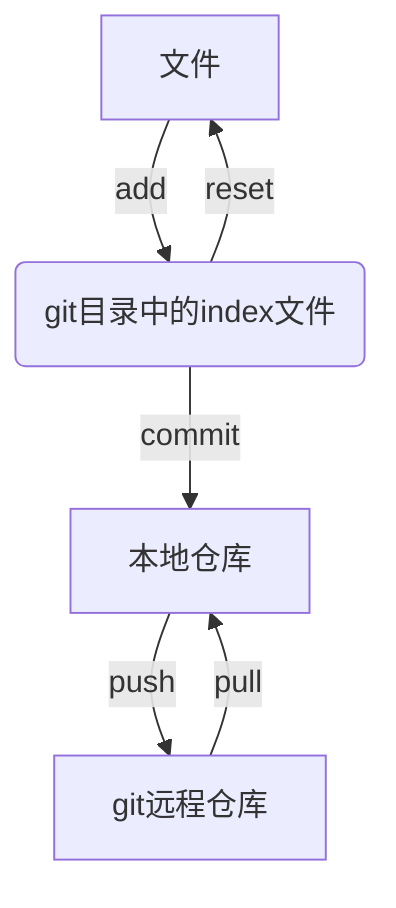

# arch linux 使用git

<!-- vscode-markdown-toc -->
* 1. [安装](#)
* 2. [配置](#-1)
* 3. [使用流程](#-1)
* 4. [使用命令](#-1)
	* 4.1. [创建一个本地版本库](#-1)
	* 4.2. [下载git文件到本地仓库](#git)
	* 4.3. [index 操作](#index)
	* 4.4. [本地仓库操作](#-1)
	* 4.5. [远程仓库操作](#-1)
	* 4.6. [分支(branch)](#branch)
	* 4.7. [标签(tag)](#tag)

<!-- vscode-markdown-toc-config
	numbering=true
	autoSave=true
	/vscode-markdown-toc-config -->
<!-- /vscode-markdown-toc -->

使用手册： <https://wiki.archlinuxcn.org/wiki/Git#%E9%85%8D%E7%BD%AE>

##  1. <a name=''></a>安装

```shell
pacman -S git
```

##  2. <a name='-1'></a>配置

至少配置姓名和邮箱

```shell
git config --global user.name "<用户名>"
git config --global user.email "<邮箱地址>"
```

##  3. <a name='-1'></a>使用流程

流程：



##  4. <a name='-1'></a>使用命令

###  4.1. <a name='-1'></a>创建一个本地版本库

1. 使用`mkdir`命令生成一个文件夹作为git本地仓库
2. `cd`进入仓库
3. 使用`git init`初始化一个git版本库

###  4.2. <a name='git'></a>下载git文件到本地仓库

```shell
git clone <repository>
```

###  4.3. <a name='index'></a>index 操作

1. 更新文件到index

    ```shell
    git add <pathspec>
    ```

2. 撤销修改

    ```shell
    git reset <pathspec>
    ```

3. 删除文件从working tree 和 index

    ```shell
    git rm <pathspec>
    ```

4. 移动重命名文件

    ``shell
    git mv <pathspec>
    ``

5. 查看修改

    ```shell
    git status
    ```

6. 重新存储working tree

    ```shell
    git restore
    ```

###  4.4. <a name='-1'></a>本地仓库操作

1. 提交更改

   ```shell
   git commit -a
   ```

    常用参数：
    + `-m`：不写提交消息，直接提交
    + `--amend`：重做上次提交

2. 撤销更改

    ```shell
    git reset
    git checkout -- 文件名
    ```

3. 删除文件

    ```shell
    git rm 文件名
    ```

###  4.5. <a name='-1'></a>远程仓库操作

1. 添加远程仓库

    默认远程库的名字为`origin`，可以修改

    ```shell
    git remote add origin git@github.com:<相关路径，比如username/repo.git>
    ```

2. 查看版本库连接的远程库

    ```shell
    git remote [-v]
    ```

3. 获取远程仓库内容

    ```shell
    git fetch <label>
    ```

4. pull
    相当于`fetch` 加 `merge`

    ```shell
    git pull <label>
    ```

5. push

    + 在push前，需要创建一个
    + 初次使用时，可以使用`-u`，将地址记录下来，以后就使用 `git push` 即可
    + 如果仓库原本有文件，使用`-f`可以强推

   ```shell
   git push [-u] [-f] origin master
   ```

6. 删除远程仓库

    ```shell
    git remote rm 远程仓库名
    ```

7. 比较远程仓库和本地仓库之间的差异

    ```shell
    git log -p <本地仓库分支名> [remotes/]<远程仓库名，一般是origin>/<远程仓库分支名>
    ```

    ```shell
    git branch -a
    ```

    ```shell
    git diff <本地仓库分支> <远程仓库名>/<分支名>
    ```

###  4.6. <a name='branch'></a> 分支(branch)

分支类似于仓库中的隔间，当我们想对项目的某一方面作出一些尝试，但不想这个尝试会影响到项目时，可以创建一个分支并将更改文件保存在这个分支中。如果后续想要将这一部分融入到项目中时，那就将这个分支融入到主分支即可。

1. 创建分支

    ```shell
    git branch <分支名>
    ```

2. 查看分支

    ```shell
    git branch
    ```

3. 切换分支

    ```shell
    git checkout <分支名>
    ```

    > 新建并却换分支
    >
    > ```shell
    > git checkout -b <分支名>
    > ```

4. 合并分支
    合并时，需要将分支切换为主分支，再进行合并

    ```shell
    git checkout <主分支名>
    git merge <分支名>
    ```

    **合并撤回**:使用`--abort`命令

    ```shell
    git merge --abort
    ```

    或

    ```shell
    git pull --abort
    ```

5. 删除分支

    ```shell
    git branch -d branch
    ```

question: 合并时的冲突问题
answer: 手工介入，进入到相应文件进行修改

###  4.7. <a name='tag'></a>标签(tag)

发布一个版本时，通常先在版本库打一个标签(tag)，代表这个版本。标签指向打标签时的仓库的快照，取某个标签，也就是将那个标签对应的历史版本取出。

1. 创建标签

    ```shell
    git tag <标签名，比如v1.0>
    ```

    **创建历史状态的标签**
    查询出历史提交的commit id，对其打上标签

    ```shell
    git log --pretty=oneline --abbrev-commit
    git tag <标签名> <commit id>
    ```

2. 查看标签

    ```shell
    git tag
    ```

3. 删除标签

    ```shell
    git tag -d <标签名>
    ```

    删除远程标签

    ```shell
    git push origin :refs/tags/<标签名>
    ```

4. 推送标签

    ```shell
    git push origin <标签名>
    ```

    推送全部标签

    ```shell
    git push origin --tags
    ```
