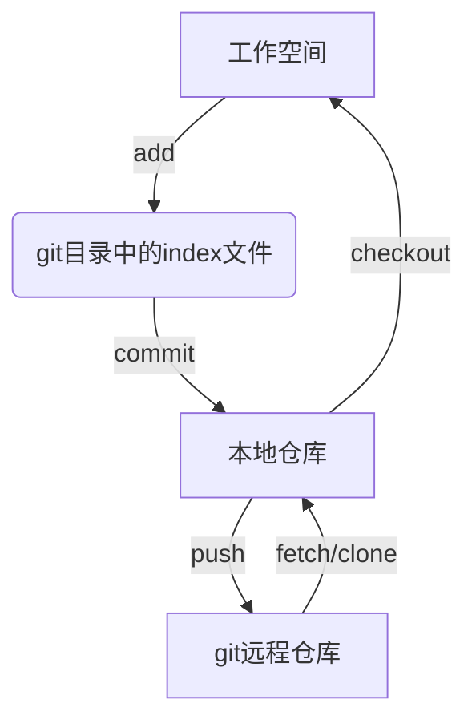
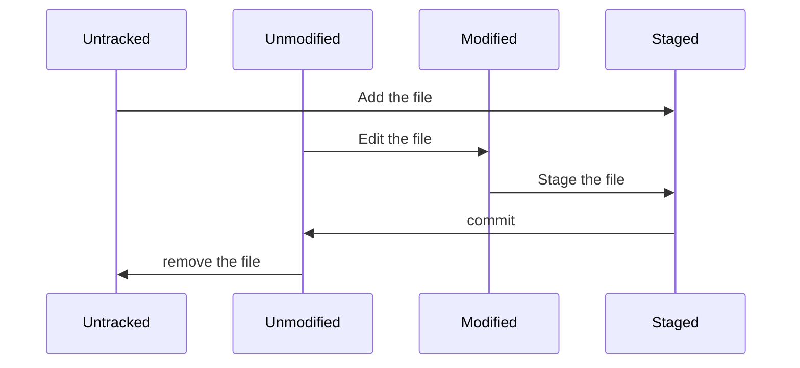

# Git

[TOC]

使用帮助手册：

+ [archlinux git wiki](https://wiki.archlinuxcn.org/wiki/Git#%E9%85%8D%E7%BD%AE)
+ [git帮助手册](https://git-scm.com/book/zh/v2/%e8%b5%b7%e6%ad%a5-%e5%85%b3%e4%ba%8e%e7%89%88%e6%9c%ac%e6%8e%a7%e5%88%b6)

## 1 概念

git 是**版本控制**的工具

版本控制：一种在开发过程中，用于管理我们对文件、目录、工程的修改历史，方便查看更改历史记录，备份以恢复历史版本的软件工程技术。

> 因为有版本迭代，所以要版本控制

版本控制分类:

1. **本地版本控制**：对每个文件做一个版本快照，或记录补丁文件，适合个人使用，如 RCS
2. **集中式版本控制**: 所有版本数据放在服务器上，协同开发者从服务器上同步更新或上传修改, 如 **SVN**
   1. 所有版本都在服务器上，每个用户只有自己本地的历史版本，断网状态的时候，无法切换分支，无法同步最新版本
   2. 所有的版本数据存储在同一服务器上，有单点故障的风险
3. **分布式版本控制**: 将所有版本信息仓库同步到本地的每一个用户，解决了集中式版本控制的两个问题，如 **Git**
   1. 所有版本信息仓库都同步到本地每一个用户，有信息泄漏等安全隐患
   2. 增加本地存储空间的占用

## 2 安装

```shell
sudo pacman -S git
```

## 3 配置

Git 的配置文件都存储在本地，共有 4 种 `ini` 类型的配置文件：

1. 系统默认配置文件: `/etc/gitconfig`
2. 用户的配置文件:
   + `~/.gitconfig`
   + `~/.config/git/config`
3. 仓库的配置文件: `.git/config`

这些文件可以直接编辑，但是更常用的方法是使用 `git config` 命令。

### 3.1 查看配置

```shell
# 查看 git 配置
git config [{--local,--global,--system}] {-l,--list} [--show-origin]　[参数]
```

+ `{--local,--global,--system}`: 限制了`git config`命令的作用域，分别对应`{本地，用户，系统}`
+ `{-l,-list}`: 将符合条件的配置信息列出
+ `--show-origin`: 列出所有配置以及它们所在文件。
+ `[参数]`: 如果设置了参数，则 `git config` 的结果会显示该参数的值。参数和`-l`只能同时出现一个

```shell
# 列出所有配置
git config -l
# 列出系统默认配置
git config --system --list
# 列出用户配置
git config --global --list
# 列出所有配置，并显示配置所在文件夹
git config -l --show-origin
# 列出用户名的属性值，并显示该配置所在文件夹爱
git config --show-origin user.name
```

### 3.2 配置姓名和邮箱

```shell
git config --global user.name "用户名"
git config --global user.email 邮箱地址
```

+ `--global`: 全局的配置，是配置一次之后，全局都会使用该信息。如果想要对特定项目配置不同的用户名称和邮箱，则在项目目录下，使用没有`--global`选项的命令

## 4 帮助

```shell
git help options
git options --help
man git-options
```

比如，想要获取`git config`的帮助手册

```shell
git help config
git config --help
man git-config
```

> 用 `-h` 而不是 `--help`，可以获得简略版帮助手册

## 3 简单的使用流程



## 4 使用命令

### 4.1 获取 git 仓库

#### 4.1.1 初始化本地

1. 使用`mkdir`命令生成一个文件夹作为git本地仓库
2. `cd`进入仓库
3. 使用`git init`初始化一个git版本库
4. 对于已经存在文件的文件夹执行后 `git commit` 步骤

   ```shell
   # 1
   git add .
   # 2
   git add LICENSE
   # 3
   git commit -m '初始版本'
   ```

#### 4.1.2 克隆现有仓库

```shell
git clone <repository>　[本地仓库名]
```

### 4.2 更新记录到仓库



文件的状态为两种：

+ 未跟踪：工作目录中除了已跟踪外的文件都属于未跟踪文件：`Untracked`
+ 已跟踪：被纳入到 git 版本控制的文件，包含:(1) `Unmodified`;(2) `modified`;(3) `Staged`。

> 1. 未跟踪文件可以通过 `git add` 操作，将其加入到已跟踪文件中，且其状态为 `Staged`。
> 2. 初次克隆的仓库，其工作目录中所有的文件都属于已跟踪文件，且其状态为 `Unmodified`。
> 3. 对工作目录中已跟踪文件编辑后，被编辑文件会被 `Git` 标记为 `Modified`。
> 4. 对于放到暂存区内的文件，`Git`　将其标记为 `Staged`

查看文件状态

```shell
git status [{-s,--short}]
```

+ `{-s,--short}`: 简洁输出

```shell
git diff
```

> 只显示尚未暂存的改动

### 4.3. index 文件操作

1. 更新文件到index -- 重点！！！

    ```shell
    git add <pathspec>
    ```

    通常 `git add .`

2. 撤销修改

    ```shell
    git reset <pathspec>
    ```

3. 删除文件从working tree 和 index

    ```shell
    git rm <pathspec>
    ```

4. 移动重命名文件

    ```shell
    git mv <pathspec>
    ```

5. 查看修改

    ```shell
    git status
    ```

6. 重新存储working tree

    ```shell
    git restore
    ```

7. 设置版本号 -- 重点！！！

    ```shell
    git add LICENSE
    ```

### 4.4. 本地仓库操作

1. 提交更改 -- 重点！！！

   ```shell
    git commit -a
   ```

    常用参数：

   * `-m`: msg，可以备注提交的事情，不必编写`commit`命令文件
   * `--amend`：重做上次提交

2. 撤销更改

    ```shell
    git reset
    git checkout -- 文件名
    ```

3. 删除文件

    ```shell
    git rm 文件名
    ```

### 4.5 远程仓库操作

主要是　`git remote` 相关操作

#### 4.5.1 密钥配置

   1. 密钥生成

        ```shell
            ssh-keygen -t rsa -C <"注册的邮箱">
        ```

        >　无论上`windows`，还是`linux`，文件都会生成在用户目录下的`.ssh`文件夹下

   2. 账户添加公钥
      1. 复制文件夹中的`id_rsa.pub`中的内容
      2. 粘贴到Github中的`SSH keys`中
            > `用户` -> `Settings` -> `SSH and GPG keys` -> `SSH keys` -> `new SSH key` -> `key` -> `Add SSH key`
            >
            > 名字随便取，但`key`，直接源码复制粘贴，不能修改任何地方

#### 4.5.2 添加远程仓库

默认远程库的名字为`origin`，可以修改

    ```shell
    git remote add origin git@github.com:<$相关路径$>

> 相关路径，一般是`username/repo.git`

#### 4.5.3 查看版本库连接的远程库

```shell
    git remote [-v]
```

#### 4.5.4 获取远程仓库内容——更新操作`fetch`——推荐操作

   从一个或多个其他存储库中获取分支和标签

   1. 获取更新

      ```shell
      git fetch <远程主机名，通常时origin> <远程主机分支名>

      # 官方文档
      git push [--all | --branches |--mirror | --tags] [--follow-tags] [--atomic] [-n | --dry-run][--receive-pack=<git-receive-pack>]
      ```

      更新所有分支时可以简化为

        ```shell
        git fetch <远程主机名>
        # 或者干脆连主机名也省略
        git fetch
        ```

        > 获取的远程分支，在本地通常使用`远程主机名/分支名`来读取，比如`origin/main`
        >
        > ```shell
        > git branch <-r 或 -a>
        > # -r：查看远程分支
        > # -a: 查看所有分支
        > ```
        >

   2. 对更新新建分支

        ```shell
        git checkout -b <新分支名> <origin/main>
        ```

   3. 查看分支

        ```shell
        git log --graph --oneline origin/main <mybranch>
        # --graph
        # --oneline : --pretty=oneline --abbrev-commit 的简写，表示（单行使用缩写）
        ```

        可以简写成：

        ```shell
        git log
        # 或者
        git log --graph
        ```

   4. 在本地合并远程分支

        ```shell
        git merge origin/main
        # 或者
        git rebase origin/main
        ```

#### 4.5.5 pull

> 相当于`git fetch` 后加上 `git merge FETCH_HEAD`

```shell
    git pull <label>
```

等价于

```c++
 git fetch
 git log --graph --oneline origin/main <mybranch>
 git merge origin/main
 # 或者
 git rebase origin/main
```

> 更推荐`git fetch`，可以保持程序员对更新操作的控制

#### 4.5.6 push

* 在push前，需要创建一个
* 初次使用时，可以使用`-u`，将地址记录下来，以后就使用 `git push` 即可
* 使用`-f`可以强制`push`文件到远程仓库

   ```shell
   git push [-u] [-f] origin master
   ```

1. 删除远程仓库

    ```shell
    git remote rm 远程仓库名
    ```

2. 比较远程仓库和本地仓库之间的差异

    ```shell
    git log -p <本地仓库分支名> [remotes/]<远程仓库名，一般是origin>/<远程仓库分支名>
    ```

    ```shell
    git branch -a
    ```

    ```shell
    git diff <本地仓库分支> <远程仓库名>/<分支名>
    ```

### 4.6. 分支(branch)

分支类似于仓库中的隔间，当我们想对项目的某一方面作出一些尝试，但不想这个尝试会影响到项目时，可以创建一个分支并将更改文件保存在这个分支中。如果后续想要将这一部分融入到项目中时，那就将这个分支融入到主分支即可。

1. 创建分支

    ```shell
    git branch <分支名>
    ```

    仓库初始化后需要指定主分支，也就是第一次创建分支，
    需要使用参数`-M`

    ```shell
    git branch -M main
    ```

2. 查看分支

    ```shell
    git branch
    ```

3. 切换分支

    ```shell
    git checkout <分支名>
    ```

    > 新建并却换分支
    >
    > ```shell
    > git checkout -b <分支名>
    > ```

4. 合并分支
    合并时，需要将分支切换为主分支，再进行合并

    ```shell
    git checkout <主分支名>
    git merge <分支名>
    ```

    **合并撤回**:使用`--abort`命令

    ```shell
    git merge --abort
    ```

    或

    ```shell
    git pull --abort
    ```

5. 删除分支

    ```shell
    git branch -d branch
    ```

question: 合并时的冲突问题
answer: 手工介入，进入到相应文件进行修改

### 4.7. 标签(tag)

发布一个版本时，通常先在版本库打一个标签(tag)，代表这个版本。标签指向打标签时的仓库的快照，取某个标签，也就是将那个标签对应的历史版本取出。

1. 创建标签

    ```shell
    git tag <标签名，比如v1.0>
    ```

    **创建历史状态的标签**
    查询出历史提交的commit id，对其打上标签

    ```shell
    git log --pretty=oneline --abbrev-commit
    git tag <标签名> <commit id>
    ```

2. 查看标签

    ```shell
    git tag
    ```

3. 删除标签

    ```shell
    git tag -d <标签名>
    ```

    删除远程标签

    ```shell
    git push origin :refs/tags/<标签名>
    ```

4. 推送标签

    ```shell
    git push origin <标签名>
    ```

    推送全部标签

    ```shell
    git push origin --tags
    ```

5. 指定标签信息

    ```shell
    git tag -a <tagname> -m "<标签信息>"
    ```

## 5. 遇到问题

1. 本地分支比远程分支版本落后，不允许更新

    解决方案：先拉再推

    ```shell
    git fetch origin main
    git log FETCH_HEAD
    git merge FETCH_HEAD

    git push origin main
    ```
