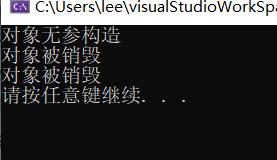
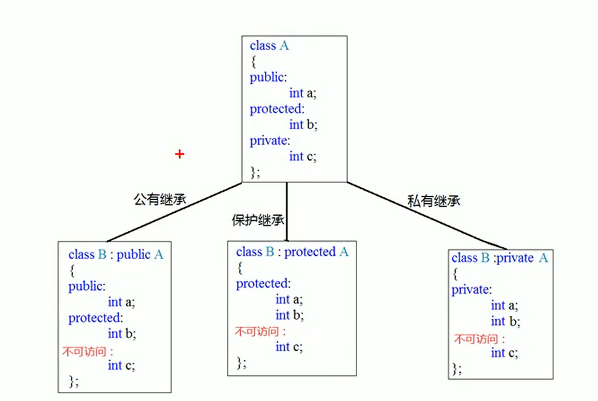
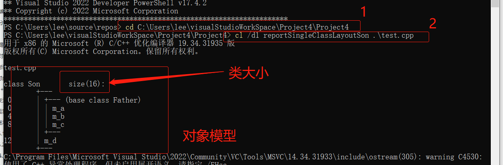
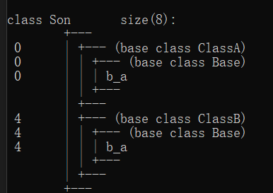
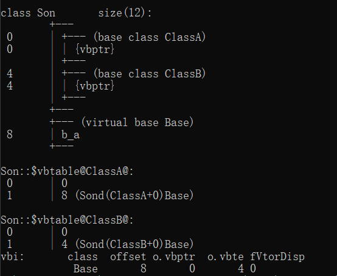
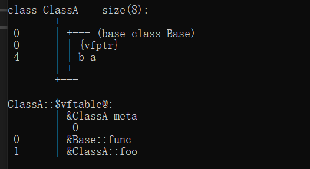
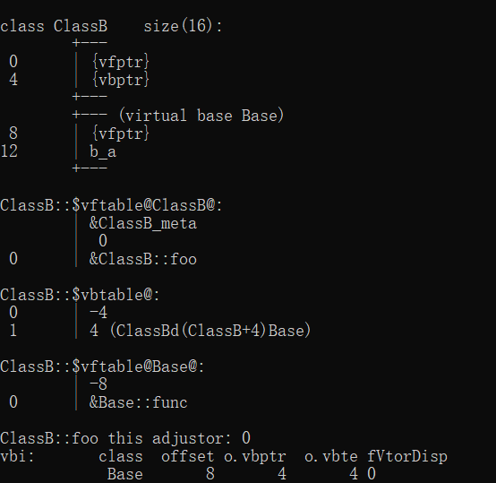
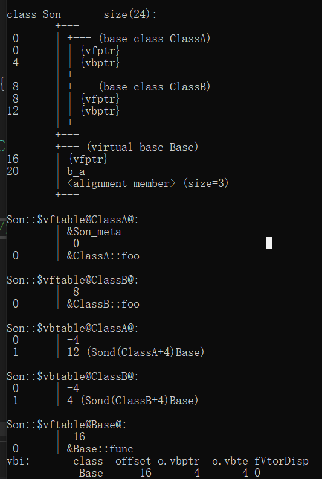

**重点：==面向对象==**

课程进度为：**lesson 84 - lesson 146**

# 01 - 程序的内存模型 - 内存四区

**内存分区模型**：

**c++程序在执行时，将内存分为四部分：**

+ **代码区**：存放函数体的**二进制代码**，由**操作系统**负责管理
+ **全局区**：存放全局变量、静态变量和常量
+ **栈区**：由**编译器**自动分配和释放，存放函数参数和局部变量
+ **堆区**：有**程序员**分配和释放。如果程序员没有释放，会在程序结束后由操作系统回收

内存分区存在的意义：

> 不同区域存放的数据，被赋予不同的声明周期，使得程序员能更灵活地编写程序

> 这个说法不是很统一，有时候是内存四区，有时候是内存五区

内存五区，从下到上

+ .text段：代码段，代码段的头部存放一些只读的常量
+ .data段：存储被初始化的全局变量和静态变量的区域
+ .bss段：存储未被初始化的全局变量和静态变量的区域
+ 堆区：由程序员负责分配(new或malloc)和释放(delete和free)。
+ 栈区：存储局部变量和函数参数的区域。由编译器自动分配和释放。  


# 02 - 程序的内存模型 - 代码区和全局区

程序运行前

**在程序编译后，生成后缀为`.exe`的可执行程序，在未执行程序前分为两个区域：**

+ **代码区**：

  + **存放CPU执行的机器指令**

  + 代码区数据是**==共享==**的。共享的目的是对于频繁执行的程序，内存中只需要保存一份代码即可
  + 代码区数据是**==只读==**的。只读的原因是防止程序意外修改了它的指令

+ **全局区**：

  + **==存放全局变量、静态变量、字符串常量、由const修饰的全局变量(全局常量)==**
  + **==全局区中的数据由操作系统负责释放==**

# 03 - 程序的内存模型 - 栈区和堆区

程序运行后：

+ **栈区**

  + **存放函数的形参和局部变量**

  + 数据的分配和释放由编译器负责

    注意：**不要返回形参或局部变量的地址**

    ​					栈区开辟的数据会被编译器自动释放

+ **堆区**

  + 由程序员负责分配和释放，或者在程序运行结束后由操作系统自动回收

  + **在C++中，主要使用==new关键字==在堆区开辟内存**

    示例代码：

    ```c++
    #include <iostream>
    using namespace std;
    
    int* newDuiQu() {
    	int *a = new int(10);
    	return a;
    }
    
    int main() {
    
    	int* p = newDuiQu();
    
    	cout << *p << endl;
    	cout << *p << endl;
    	cout << *p << endl;
    
    	system("pause");
    	return 0;
    }
    ```

    解释：

    > 在函数中使用`new`关键字在堆区开辟了内存
    >
    > 将关键字保存在一个指针中，将内存地址返回
    >
    > 指针还是在栈区中，但指针中存放的地址是堆区的内存地址

# 04 - 程序的内存模型 - new操作符

使用`new`关键字在堆区开辟内存空间

1. `new`关键字在堆区开辟变量的内存空间

   语法：`int* 变量名 = new 数据类型(初始值);`

2. `new`关键字在堆区开辟数组的内存空间

   语法：`int* 数组名 = new 数据类型[数组长度];`

3. `new`的返回值是**该数据类型的一个指针**

使用`delete`关键字释放内存空间

1. `delete`关键字释放变量的内存空间

   语法：`delete 变量名;`

2. `delete`关键字释放数组的内存空间

   语法：`delete[] 数组名;`

# 05 -  引用 - 引用基本语法

`int a = 10;`

解释：在系统某一块内存中存在一块内存，这个内存中存放的数据为10，a代表这一块内存

作用：给变量起别名

语法：`数据类型 &别名 = 变量名;`

> + 引用的数据类型必须要原变量的数据类型保持一致
> + 引用创建的别名和原变量名，二者代表的是同一块内存，只是称呼改变了而已，“起别名”嘛

# 06 -  引用 - 引用的注意事项

+ **引用必须被初始化**
+ **引用一旦初始化，就不可以更改了**

# 07 - 引用 - 引用做函数参数 - 引用传递

参数传递的三种方法：

1. 值传递 - 形参不会修饰实参

2. 地址传递 - 形参会修饰实参

3. 引用传递 - 形参会修饰实参

   示例代码：

   ```c++
   #include <iostream>
   using namespace std;
   
   void swap01(int &a, int &b) {
   	int temp = a;
   	a = b;
   	b = temp;
   }
   
   int main() {
   
   	int a = 10;
   	int b = 20;
   
   	swap01(a,b);
   
   	cout << a << endl;
   	cout << b << endl;
       
   	system("pause");
   	return 0;
   }
   ```

   

   >  原因：如上述示例，`swap01()`函数中的两个形参为`int &a`、`int &b`，而传入是实参为`a`和`b`也就是说，在参数传递时，形参`a`和`b`就变成了实参`a`和`b`的两个别名(和原名一样的别名，hh)也就是说，形参`a`和`b`对应的内存空间就是实参`a`和`b`对应的内存空间所以对形参`a`和`b`的操作，其实就是在对实参`a`和`b`的操作

# 08 - 引用 - 引用做函数返回值

+ 不能传递局部变量的引用
  + 还是同样的道理，局部变量在函数执行结束后，会被编译器自动释放
+ 当引用做函数返回值的时候，可以做等式的左值被赋值
  + 类似于三元操作符，返回的是一个变量，是可以被赋值的

# 09 - 引用 - 引用的本质

==**引用本质上就是一个指针常量**==

+ 所以，前言中”引用一旦被初始化之后，就不能被更改“，也就是因为引用的本质是一个指针常量
+ 复习：
  + 常量指针：指向一个常量的指针，值不可以改，指向可以改
  + 指针常量：指针是一个常量，指针指向的值可以改，但指向不可以改

代码：

```c++
#include <iostream>
using namespace std;

int main(){
    
    //创建一个变量
    int a = 10;
    
    //声明一个引用
    int& ref = a;//编译器会自动将这个语法转换为   int const* ref = &a;
    ref = 20;//编译器发现ref是引用后，会自动将这个语法转换为   *ref = 20;
    
    cout << "ref = " << ref << endl;
    cout << "a = " << a << endl;
     
    system("pause");
    return 0;
}
```


# 10 -  引用 - 常量引用

作用：修饰形参，防止误操作

+ 地址传递中使用`const`修饰形参防止误操作

使用场景：函数功能中不含有参数修改操作时，应该传入常量引用

代码：

```c++
#include <iostream>
using namespace std;

int printVal(int& val){
    cout << "val = " << val <<endl;
}

int main(){
    
    int a = 10;
    //int& ref = 10;//引用必须指向一个合法内存
    const int& ref = 10;//允许，编译器会将语句自动转化为 
    //int temp = 10;const int& ref = temp;
    
    //const 修饰形参
    
    
    system("pause");
    return 0;
}
```

# 11 - 函数 - 函数的默认参数

语法：`返回值类型 函数名(参数 = 默认参数值){}`

代码：

``` c++
#include <iostream>
using namespace std;

//函数 - 默认参数
//语法：返回值类型 函数名(参数 = 默认值){}
int sumNums(int a, int b = 10, int c = 20) {

	return a + b + c;

}
//注意事项：
//1. 参数列表中，如果某一位置的参数有了默认值，那么该参数右边的参数都需要有默认值
//否则会报错
//int sumNums(int a, int b = 10, int c) {
//
//	return a + b + c;
//
//}

//2. 函数的声明和定义中，同时只能有一个中有默认参数，二者不能同时有默认参数
int sumNums1(int a, int b, int c);
int sumNums1(int a, int b, int c = 20) {
	return a + b + c;
}

int sumNums1(int a, int b, int c = 20);
int sumNums1(int a, int b, int c ) {
	return a + b + c;
}

int main() {

	//调用函数时，对于有默认值的形参，如果有传入实参，就使用传入的实参
	//如果没传入实参，就是使用默认值
	int res = sumNums(10, 20, 30);

	system("pause");
	return 0;
}
```

> 注意事项：
>
> + 参数列表中，如果某一位置的参数有了默认值，那么该参数右边的参数都需要有默认值，否则会报错
> + 调用函数时，对于有默认值的形参，如果有传入实参，就使用传入的实参；如果没传入实参，就是使用默认值

# 12 - 函数 - 函数的占位参数

函数的参数列表中可以有占位参数，在调用该函数时，占位参数必须有值

只有数据类型，没有变量名

语法：`返回值类型 函数名(数据类型){}`

> 占位参数可以有默认值

代码：

```c++
#include <iostream>
using namespace std;

//函数 - 占位参数
int sumNums(int a, int) {

	return a;

}
//占位参数可以有默认值
int sumNums1(int a, int = 10) {

	return a;

}


int main() {

	//函数调用时必须填充占位参数
	int res = sumNums(10, 20);

	//当函数的占位参数有默认值时，调用时不必须传参
	int res1 = sumNums1(10);

	system("pause");
	return 0;
}
```

# 13 - 函数 - 函数重载

作用：函数名相同，参数列表不同，提高代码的复用性

函数重载的三个条件：

+ 函数的作用域相同
+ 函数名相同
+ 函数的参数个数不同、类型不同或顺序不同

> 函数的返回值不同，不能作为函数重载的条件

代码：

```c++
#include <iostream>
using namespace std;

//函数 - 函数的重载

//参数重载的三个条件
//1. 作用域相同
//2. 函数名相同
//3. 参数的个数不同、类型不同或顺序不同
void func() {
	cout << "调用func()函数" << endl;
}
//参数个数不同
void func(int a) {
	cout << "调用func(int a)函数" << endl;
}
//参数数据类型不同
void func(double a) {
	cout << "调用func(double a)函数" << endl;
}
//参数顺序不同
void func(int a, double b) {
	cout << "调用func(int a, double b)函数" << endl;
}
//参数顺序不同
void func(double a, int b) {
	cout << "调用func(double a, int b)函数" << endl;
}

//函数的返回值不同，不能作为重载的条件
//int func(int a) {
//	return a;
//}

int main() {

	func();
	func(10);
	func(3.14);
	func(10, 3.14);
	func(3.14, 10);

	system("pause");
	return 0;
}
```

# 14 - 函数 - 函数重载 - 函数重载的注意事项

1. 引用作为参数重载的条件：有`const`修饰的引用和无`const`修饰的引用被认为是两种数据类型

   ```c++
   int func(int& a){...}
   
   int func(const int& a){...}
   
   //函数调用
   int a = 10;
   func(a);//调用int func(int& a)
   //因为a是变量，而int func(const int& a)要求传入一个常量
   //所以func(a)调用int func(int& a)
   
   func(10);//调用int func(const int& a)
   //func(10):当函数传入的实参是10时，遇到第一个函数时，发生int& a = 10，不合法语法
   //引用的地址必须是合法的，常量10地址在全局区，不可以访问
   //遇到第二个函数时，发生const int& a = 10，
   //编译器会自动转化语法为int temp = 10; const int&a = temp;
   //所以func(10)会调用int func(const int& a)
   ```

   

2. 当函数重载遇到默认参数 —— 函数重载时尽量不适用默认参数

   ```c++
   int func(int a){...}
   
   int func(int a, int b = 10){...}
   
   //函数调用时，只传入一个参数时，会出现二义性
   //func(10)//报错，编译时不报错，调用时报错
   func(10, 20)//成功调用
   ```

# 15 - 类和对象 - 封装

## 1 封装介绍

### 1 概念

java的三大特性和C++的一样

**C++三大特性：封装、继承、多态**

对象：拥有属性和方法

类：将拥有一样性质的对象，抽象出来为一个类，比如，猴子和猩猩，大部分的属性和方法是类似的，就可以抽象出灵长类动物这个类

类应该具有的三个要素：

+ 权限
+ 属性
+ 函数

> 类中的属性和行为统一称为：成员
>
> 类中的属性：成员属性  成员变量
>
> 类中的行为：成员函数  成员方法

实例：

```c++
#include <iostream>
using namespace std;

//类和对象 - 封装

const double PI = 3.14;
//写一个圆的类，求圆的周长
//圆周长计算公式： ZC = 2 * PI * r;
//圆类应该具有属性半径r以及求周长的方法
class circle {

	//权限
	//公共权限
public:

	//属性
	double m_r;

	//方法
	double calculateZC(double m_r) {
		return 2 * PI * m_r;
	}
};

int main() {

	//根据圆类，创建一个圆的对象
	//实例化：根据类创建对象的过程
	circle cl;
	int m_r = 10;

	cout << "圆的周长为" << cl.calculateZC(m_r) << endl;

	system("pause");
	return 0;
}
```

### 2 设计学生类

题目：设计一个学生类，属性拥有姓名和学号，可以给姓名和学号赋值，可以显示学生的姓名和学号

```c++
#include <iostream>
using namespace std;

//类和对象 - 封装
//题目：设计一个学生类，属性拥有姓名和学号，可以给姓名和学号赋值，可以显示学生的姓名和学号
class student {

public:

	string name;
	int cno;

	//赋值
	void setName(string a) {
		name = a;
	}
	void setCno(int b) {
		cno = b;
	}

	//打印姓名学号
	void printStu() {
		cout << "姓名为：" << name << " 学号为：" << cno << endl;
	}

};


int main() {
	
	student stu;

	stu.setName("张三");
	stu.setCno(123);

	student stu2;

	stu2.setName("李四");
	stu2.setCno(2);

	stu.printStu();
	stu2.printStu();

	system("pause");
	return 0;
}
```

## 2 访问权限

C++中的三种权限：

+ **公共权限`public`**：类内类外都可以访问成员
+ **保护权限`protected`**：
  + 类内可以访问成员，类外不可以访问成员；
  + 继承时，子类可以访问父类被保护的属性和方法

+ **私有权限`private`**：
  + 类内可以访问，类外不可以访问；
  + 继承时，子类不可以访问父类被保护的属性和方法


> Java中多了一种默认权限
>
> **C++中，类中成员的默认的访问权限为`private`**

代码：

```c++
#include <iostream>
using namespace std;

//类和对象 - 封装 - 权限
class People {
public:
	string name;
protected:
	string car;
private:
	int cardID;
public:
	void setPeople() {
		//三种权限，类内都可以访问
		name = "张三";
		car = "奔驰";
		cardID = 1241541;
	}
};
class Someone:public People {
public:
	void printBaseName() {
		cout << name << endl;			//public	子类可以访问
	}
	void printBaseCar(){
		cout << car << endl;			//protected 子类可以访问
	}
	//void printBaseCarID() {
	//	cout << this->cardID << endl;	//private   子类不可访问
	//}
};
int main() {

	People p1;
	p1.name = "李四";
	//p1.car = "宝马";					//protected 类外不可以访问，没有访问权限
	//p1.cardID = 51512;				//private 类外不可以访问，没有访问权限

	system("pause");
	return 0;
}
```

## 3 成员变量

### 问题：类对象作为类成员

问题：当一个类对象作为另一个类的成员时，其二者构造和析构的顺序如何？

代码：

```c++
#include<iostream>
using namespace std;
class Phone {
public:
	Phone() {
	}
	Phone(string name) {
		this->phoneName = name;
		cout << "Phone的构造函数" << endl;
	}
	~Phone() {
		cout << "Phone的析构函数" << endl;
	}
public:
	string getPhoneName() {
		return phoneName;
	}
private:
	string phoneName;
};
class Person {
public:
	Person() {
	}
	Person(string name, string phoneName) {
		this->name = name;
		cout << "Person的构造函数——phone的构造函数前" << endl;
		this->phone = phoneName;
		cout << "Person的构造函数——phone的构造函数后" << endl;
	}
	~Person() {
		cout << "Person的析构函数" << endl;
	}
public:
	string get_name() {
		return name;
	}
	string get_phoneName() {
		return phone.getPhoneName();
	}
private:
	string name;
	Phone phone;
};

int main() {

	Person p("张三","苹果");
	cout << "p.name = " << p.get_name() << "\n";
	cout << "p.phone.phoneName = " << p.get_phoneName() << "\n";

	return 0;
}
```

> 分析：上述代码中
>
> 1. 构造顺序：
>
>    先调用了`Person`类的有参构造函数，
>
>    然后再调用`Phone`类的有参构造函数，
>
>    当`Phone`对象构造完成后，继续`Person`对象的构造；
>
> 2. 析构顺序： 
>
>    析构顺序和构造完成的顺序相反——**先构造的后析构，后构造的先析构**
>
>    (类似于栈)

> 类只有在拥有其完整声明之后，才能进行使用
>
> 比如上述代码，对`Phone`类的使用，一定要在`Phone`类的完整声明之后

## 4 成员函数

## 5 静态成员

### 1 静态成员变量

**特性**：

1. 共享内存

   **所有对象共享同一份内存**

2. **类内声明，类外初始化**

3. **在编译阶段就分配内存**

   > 这也是为什么静态成员属性必须在声明后，立刻进行初始化
   >
   > 如果没有对静态成员属性进行初始化，就会报`无法解析的外部符号`错误，也就是未定义错误

#### 1 创建

**类内声明，类外初始化**

```c++
#include<iostream>
using namespace std;
class Person {
public:
	static int m_a1;
	static const int a = 0;
private:
	static int m_a2;
	int m_b;
};
int Person::m_a1 = 100;
int Person::m_a2 = 200;
```

> 唯一例外：静态常量成员变量

对象模型：

#### 2 访问权限

静态成员变量存在权限，和普通成员变量一样

#### 3 访问方式

+ 通过对象访问

  ```c++
  对象名.静态成员变量名;
  ```

+ 通过类名访问

  ```c++
  类名::静态成员变量名;
  ```
  > 为什么能通过类名访问静态成员变量？
  > 	因为静态成员变量本就不属于某一个具体对象，而是属于类，所有的类对象共享这个变量
  > 	同时，上述原因也是对象内存模型不包含静态成员变量的原因

### 2 静态成员函数

**特性：**

1. 所有对象共享静态成员函数

   > 非静态成员函数也是所有对象共享

2. **静态成员函数只能访问静态成员变量，不能访问非静态成员变量**

3. 函数中没有**this**指针

> 非静态成员函数和静态成员函数的本质区别：有无**this**指针
>
> - 非静态成员函数参数列表中的首个参数为`this`指针，这样成员函数才只能知道是哪个对象调用了它，也因此，非静态成员函数才能够访问成员变量，能够使用`this`指针
> - 静态成员函数参数列表中则没有`this`指针，也是特性2和特性3出现的原因

#### 1 访问数据的权限

静态成员函数只能访问静态成员变量，不能访问非静态成员变量

```c++
	static void func() {
		m_a1 = 100;
		//m_b = 200;
	}
```

> 原因：
>
> + 静态成员函数也是属于类的，而不是属于类的某一实例对象
>
>   静态成员变量由所有对象共享，而非静态成员变量则跟对应对象绑定
>
>   所以，对于静态成员函数，静态成员变量是可以唯一确认的，而非静态成员变量则不是。

#### 2 函数的访问权限

同非静态成员函数一样，也具有访问权限

#### 3 调用方式

同静态成员变量的访问方式，具有两种

+ 通过对象调用

  ```c++
  对象名.静态成员函数名(参数列表);
  ```

+ 通过类名调用

  ```c++
  类名::静态成员函数名(参数列表);
  ```

## 5 - 类和对象 - 封装 - c++中class和struct的区别

主要区别：**默认访问权限不同**

==**在C++中，class中成员的默认访问权限是`private`**==

==**而struct中成员的默认访问权限是`public`**==

代码：

```c++
#include <iostream>
using namespace std;

//类和对象 - 封装 - class和struct的区别
class people {
	string name;
};
struct persons {
	string name;
};


int main() {
	
	people p1;
	//p1.name = "张三";//在c++中，class中成员的默认访问权限是private，所以这里报错，没有访问权限

	persons p2;
	p2.name = "李四";//在c++中，struct中成员的默认访问权限是public

	system("pause");
	return 0;
}
```

> C++ 中`struct`和`class`的区别：
>
> |              | struct     | class          |
> | ------------ | ---------- | -------------- |
> | 概念         | 数据结构   | 对象数据的封装 |
> | 默认访问权限 | `public`   | `private`      |
> | 默认继承权限 | `public`   | `private`      |
> | 定义模板参数 | 不可以定义 | 可以定义       |
>
> + `struct`的目的是创造的是一个数据类型，而class想做的则是封装一个对象
>
>   从这个初衷出发，则自然而然就理解为什么struct的默认权限和class不同了

## 6 - 类和对象 - 封装 - 成员属性私有化

**在创建类后，最好将类中的属性的权限设置成`private`**

**我们可以通过属性的`set()`方法和`get()`方法来设置和获取数据**

优点：

1. 权限控制
2. 数据验证

代码：

```c++
#include <iostream>
using namespace std;

//类和对象 - 封装 - 成员变量私有化
//在类中使用set()和get()方法来修改和获得数据
//1. 同时使用这两种方法可以控制数据的读写权限
//2. 在set()和get()方法中可以做数据验证
class people {
private:
	string p_name;
	int p_age;
	string p_friends[10];
public:
	void setName(string name) {
		p_name = name;
	}
	void setAge(int age) {
		p_age = age;
	}
	void setFriends() {
		string friendsN = "ABCDEFGHIJ";
		for (int i = 0; i < 10; i++) {
			p_friends[i] = friendsN[i];
		}
	}
	void getName() {
		cout << "这个人姓名是：" << p_name << endl;;
	}
	void getAge() {
		if (p_age < 0 || p_age > 150) { //数据验证
			p_age = 0;
			cout << "您输入的年龄好神奇啊，别调皮嗷，输入正经年龄" << endl;
		}
		cout << "这个人的年龄为：" << p_age << endl;
	}
private:
	void getFriends() {
		for (int i = 0; i < 10; i++) {
			cout << p_friends[i] << " ";
		}
		cout << endl;
	}
};


int main() {
	
	people p1;

	//p_name -- 可读可写权限
	p1.setName("何石爱");
	p1.getName();

	//p_age -- 只读权限
	p1.setAge(18);
	p1.getAge();

	//p_friends -- 只写权限
	p1.setFriends();
	//p1.getFriends();

	system("pause");
	return 0;
}
```

## 8 - 案例

### 1 立方体类

题目：设计立方体类(Cube)

求出立方体的面积和体积

分别用全局函数和成员函数判断两个立方体是否相等

分析：

求出立方体的面积和体积

​	立方体的面积公式：2 * (长 \* 宽  + 长 \* 高 + 宽 \* 高 ) = 面积

​	立方体的体积公式：长 \* 宽 \* 高 = 体积

立方体类：

+ 类名：Cube
+ 属性：
  + 长
  + 宽
  + 高
+ 方法：
  + 求面积
  + 求体积

立方体相等：

​	长宽高相等

代码：

```c++
#include <iostream>
using namespace std;

//类和对象 - 封装 - 立方体
class Cube {
private:
	double C_length;//长
	double C_width;//宽
	double C_height;//高

public:
	//set()方法
	void setLength(double length) {
		C_length = length;
	}
	void setWidth(double width) {
		C_width = width;
	}
	void setHeight(double height) {
		C_height = height;
	}
	//get()方法
	double getLength() {
		return C_length;
	}
	double getWidth() {
		return C_width;
	}
	double getHeight() {
		return C_height;
	}
	//面积
	double Mian_Cube() {
		return 2 * (C_length * C_width + C_width * C_height + C_length * C_height);
	}
	//体积
	double Ti_Cube() {
		return C_length * C_width * C_height;
	}
	bool isSameCube(Cube c) {
		if (c.Ti_Cube() == this->Ti_Cube() && c.Mian_Cube() == this->Mian_Cube()) {
			return true;
		}
		return false;
	}
};

bool isSameCube(Cube c1, Cube c2) {
	if (c1.Ti_Cube() == c2.Ti_Cube() &&
		c1.Mian_Cube() == c2.Mian_Cube()) {
		return 1;
	}
	else return 0;
}
int main() {
	
	Cube c1, c2;

	c1.setHeight(9);
	c1.setLength(10);
	c1.setWidth(10);
	cout <<"体积为：" << c1.Ti_Cube() << endl;
	cout << "面积为：" << c1.Mian_Cube() << endl;

	c2.setHeight(10);
	c2.setLength(9);
	c2.setWidth(10);
	if (c1.isSameCube(c2)) {
		cout << "c1等于c2" << endl;
	}
	else {
		cout << "c1不等于c2" << endl;
	}

	//if (c1.Ti_Cube() == c2.Ti_Cube() &&
	//    c1.Mian_Cube() == c2.Mian_Cube()) {
	//	cout << "相等" << endl;
	//}
	//else cout << "不相等" << endl;

	if (isSameCube(c1, c2)) {
		cout << "相等" << endl;
	}
	else {
		cout << "不相等" << endl;
	}
	


	system("pause");
	return 0;
}
```

### 2 点和圆

题目：设计一个圆形类(Circle)，和一个点类(Point)，计算点和圆的关系

```c++
#include <iostream>
using namespace std;

//类和对象 - 封装 - 点和圆

class Point {
private:
	//坐标
	int p_x;
	int p_y;
public:
	//set and get
	void setLocation(int x, int y) {
		p_x = x;
		p_y = y;
	}
	std::pair<int,int> getLocation() {
		std::pair<int,int> res = std::make_pair(p_x, p_y);
		return res;
	}
};
class Circle {
private:

	//圆心
	Point center;

	//半径
	double r;

public:
	//set and get
	void setCenter(int x,int y) {
		center.setLocation(x, y);
	}
	void setR(int l) {
		r = l;
	}
	Point getCenter() {
		return center;
	}
	double getR() {
		return r;
	}

	//判断点的位置
	int isPointOnCircleByClass(Point point) {
		int p_x = point.getLocation().first;
		int p_y = point.getLocation().second;

		int c_x = center.getLocation().first;
		int c_y = center.getLocation().second;

		double distance = pow(pow(p_x - c_x, 2) + pow(p_y - c_y, 2), 0.5);

		if (distance < r) {
			cout << "在圆内" << endl;
			return 0;
		}
		else if (distance == r) {
			cout << "在圆上" << endl;
			return 1;
		}
		else {
			cout << "在圆外" << endl;
			return 2;
		}

	}
};
int isPointOnCircle(Circle circle,Point point) {

	Point center = circle.getCenter();
	double r = circle.getR();

	int p_x = point.getLocation().first;
	int p_y = point.getLocation().second;

	int c_x = center.getLocation().first;
	int c_y = center.getLocation().second;

	double distance = pow(p_x - c_x, 2) + pow(p_y - c_y, 2);
	double r2 = r * r;

	if (distance < r2) {
		cout << "在圆内" << endl;
		return 0;
	}
	else if (distance == r2) {
		cout << "在圆上" << endl;
		return 1;
	}
	else {
		cout << "在圆外" << endl;
		return 2;
	}
}


int main() {
	Point point;
	point.setLocation(3, 4);
	Circle circle;
	circle.setCenter(5, 3);
	circle.setR(3);
	isPointOnCircle(circle,point);


	system("pause");
	return 0;
}
```

# 22 - 类和对象 - 对象特性 - 构造函数和析构函数

## 1 构造函数和析构函数

### 1 构造函数——初始化操作

+ 没有返回值，不用写void
+ 函数名和类名相同

+ 有参数，允许函数重载
+ 程序在调用对象时时，自动调用构造函数，只调用一次

### 2 析构函数——清理操作

+ 没有返回值，不用写void
+ 函数名和类名相同，但在名称前需要加上符号`~`，即`~类名`
+ 没有参数，不可以函数重载
+ 程序在销毁对象前，会自动调用析构函数，只调用一次

代码：

```c++
#include <iostream>
using namespace std;

//类和对象 - 封装 - 点和圆
class a {
public:
	a() {
		cout << "对象无参构造" << endl;
	}
	a(int num) {
		cout << "使用一个参数，对象被构造" << endl;
	}
	a(int num1, int num2) {
		cout << "使用两个参数，对象被构造" << endl;
	}
	~a() {
		cout << "对象被销毁" << endl;
	}
};
void doWork1() {//1
	a example;
}
a doWork2() { //2
	a example;
  return example;
}
int main() {

	doWork2();

	system("pause");
	return 0;
}
```

调用`doWork2()`结果：



> 2代码，会在命令行窗口打印两次对象被销毁
>
> 原因：当返回值为一个对象时，会在return时，调用对象的拷贝构造函数
>
> 也就是说，构造函数和析构函数的调用顺序其实是：
>
> `doWork(); `//开始
>
> ​				     	 // 进入到doWork()函数中
>
> ​	`a example;`  // 调用a的无参构造函数，创建对象example
>
> ​	`return a;  `    //调用函数的拷贝构造函数，拷贝example对象 ，传递给doWork();
>
> ​						 //函数执行结束，example调用析构函数
>
> `doWork(); `//结束
>
> ​				  //程序运行到`doWork();`下一行，匿名对象调用析构函数

## 2 构造函数的分类及调用

### 1 构造函数的分类

+ 无参构造-默认构造函数

  ```c++
  类名(){
      ...
  }
  ```

  

+ 有参构造

  ```c++
  类名(参数列表){
      ...
  }
  ```

  

+ 拷贝构造

  ```c++
  类名(const 类名& 对象名){
      ...
  }
  ```


### 2 调用方法

+ 括号法

  ```c++
  类名 对象名(参数);//有参构造
  类名 对象名(同类的某个对象);//拷贝构造函数调用
  ```
  
  > `类名 对象名()`的形式是不可以的，会被编译器当成是函数的声明，从而不会创建对象

+ 显式法

  ```c++
  类名 对象名 = 类名(参数);
  类名 对象名 = 类名(同类的某个对象);//拷贝构造函数调用
  //匿名对象，匿名对象所在的一行代码运行完毕后，匿名对象会立刻调用析构函数
  类名(); //匿名对象无参函数调用 
  类名(参数);//匿名独享有参函数调用
  ```

  > 不可以调用拷贝构造函数创建匿名对象——`类名(同类的某个对象)`，这个语法会转化为`类名 对象名`，被编译器当成是对象的无参调用，重而导致重定义错误

+ 隐式法

  ```c++
  类名 对象名;//无参构造
  类名(对象名);//无参构造
  类名 对象名 = 参数;//有参构造
  类名 对象名 = 同类的某个对象;//拷贝构造函数调用
  ```

代码：

```c++
#include <iostream>
using namespace std;

//类和对象 - 构造函数的分类和调用方法
class Person {
private:
	int age;
public:
	Person() {
		cout << "对象无参构造" << endl;
	}
	Person(int num) {
		age = num;
		cout << "对象有参构造" << endl;
	}
	//拷贝构造
	Person(const Person& p) {
		age = p.age;
		cout << "对象的拷贝构造" << endl;
	}

	int getAge() {
		return age;
	}

	~Person() {
		cout << "对象被销毁" << endl;
	}
};
void doWork() {
	
	//括号法：
	//Person p1;
	//Person(p2);//同上一行代码等价
	// 	//注意1：无参构造时，对象名后不可以加()--Person p();	
	//Person p3();				//会被编译器当成是函数的声明，函数名为p，返回值为Person的函数的声明
	//Person p4(10);              //有参构造
	//Person p5(p1);				//拷贝构造
	
	//显示法：
	//Person p6 = Person(10);   //有参构造
	//Person p7 = Person(p3);   //拷贝构造
	//Person(10);               //匿名对象 当这一行代码结束后，匿名对象会被立刻清理掉
	//注意2：不要用拷贝函数创建匿名对象
	//Person(p6);				//会被编译器自动转化为 Person p6; 会报重定义错误

	//隐式法：
	//Person p5 = 10;			//有参构造
	//Person p6 = p5;			//拷贝构造
}

int main() {

	doWork();

	system("pause");
	return 0;
}
```

## 3 拷贝构造函数的使用时机

1. 使用一个已经创建好的对象，创建一个新对象

   ```c++
   类名 对象名(同类的一个对象);
   ```

   

2. 值传递的方式给函数传值

   ```c++
   函数调用:
   函数名(对象名);
   ```

   > 函数的参数为对象，当调用这个函数时，`类名 形参 = 类名(实参);`

3. 函数以值方式返回局部对象

   ```c++
   //函数定义
   对象类名 函数名a(参数列表){
       ...;
       return 对象;
   }
   //调用
   类名 对象名 = 函数名a(参数);
   ```

   > 存疑：
   >
   > 返回值为局部对象的函数，当调用该函数——`类名 对象名 = 函数名a(参数);`，`return`语句时，局部对象会调用拷贝构造函数，将拷贝的值返回，也即`类名 对象名 = 类名(局部对象)`

   > 经过实验，发现现在c++会直接将对象返回，而不会调用拷贝函数，但如22节中的代码2，则发生如上过程，所以对于返回值是对象的情况，是调用拷贝构造函数，还是直接返回这个局部变量，是存疑的

代码：

`class Person`

```c++
class Person {
private:
    int age;
public:
	Person() {
		cout << "对象无参构造" << endl;
	}
	Person(int num) {
		age = num;
		cout << "对象有参构造" << endl;
	}
	Person(const Person& p) {
		cout << "对象的拷贝构造" << endl;
	}

	int getAge() {
		return age;
	}

	~Person() {
		cout << "对象的析构函数调用" << endl;
	}
};
```

1、以一个对象创建另一个对象

```c++
void test01() {
	
	Person p1(20);
	Person p2(p1);
}
```


2、值传递的方式给函数传值

```c++
void doWork(Person p) {

}
void test02() {
	Person p3;
	doWork(p3);
}
```


3、返回值为局部对象

```c++
Person doWork2() {
	Person p4;
	return p4;
}
void test03() {
	Person p5 = doWork2();
}
```

## 4 构造函数的调用规则

1. 在写一个类出来后，编译器会自动为这个类提供三种默认方法
   1. 默认的无参构造方法（空方法体）
   2. 默认的有参构造方法（空方法体）
   3. 默认的拷贝构造方法（值拷贝）
2. 当我们定义了有参构造方法后，编译器将不再提供默认的无参构造方法，但仍然提供默认的拷贝构造方法
3. 当我们定义了拷贝构造方法后，编译器将不再提供默认的无参构造和有参构造方法

> 所以，我们在重写类的构造方法的时候，应该先重写无参构造方法，再重写有参构造方法，最后再重写拷贝构造方法，避免出现不必要的错误

# 26 - 类和对象 - 对象性质 - 深拷贝和浅拷贝

浅拷贝：值拷贝

深拷贝：在堆区开辟一块新的内存空间，然后进行值拷贝

**==编译器提供的默认拷贝构造函数采用的是浅拷贝的方法==**

**问题：**

类Person

```c++
class Person{
public:
    Person(){
        cout << "Person的无参构造函数"<<endl;
    }
    Person(int num1,int num2){
        age = num1;
        height = new int(num2); //开辟在堆区的变量
        cout << "Person的有参构造函数"<<endl;
    }
    ~Person(){
        //在析构函数中需要对开辟在堆区的变量进行释放
        delete height;
        height = NULL;
        cout <<"Person的析构函数" <<endl;
    }
    int age;
    int *height;
}
```

调用

```c++
Person p1(10,20);
Person p2(p1);
```

**在第13行会报出现断点错误**

**原因：**`Person p1(10,20);`语句调用了Person的有参构造函数，创建了对象p1

Person p2(p1);语句调用了Person的默认拷贝构造函数，创建了对象p2

编译器提供的默认拷贝构造函数，将p1的属性age和height浅拷贝到了p2的对应属性中

​	默认拷贝构造函数提供的浅拷贝方法：

​		age = p.age

​		height = p.height

在对象p1和对象p2声明周期结束后，局部变量存放在栈区中，先进后出

所以p2先调用析构函数，将存放在堆区的变量p2.height释放

由于p1.gheight的值是由p2.height浅拷贝得来的，也就是说，p1.height和p2.height中存放的内存地址是同一个

所以之后当p1调用析构函数时，`delete height;`语句，想要去清除p1.height占用的空间时，p1.height占用的空间已经被清除掉了，也就是会导致出现**非法访问**的错误

> 总结：当遇到如上情况时，使用浅拷贝会导致重复删除堆区空间的错误

解决方法：使用深拷贝

代码：

```c++
#include <iostream>
using namespace std;

//类和对象 - 深拷贝和浅拷贝
class Person {
public:
	Person() {
		cout << "Person的无参构造函数" << endl;
	}
	Person(int num) {
		age = num;
		cout << "Person的有参构造函数" << endl;
	}
	Person(int num, int num2) {
		age = num;
		height = new int(num2);
	}
	Person(const Person& p) {
		cout << "Person的拷贝构造函数" << endl;
		age = p.age;
		//height = p.height;//浅拷贝，编译器默认提供的值拷贝语句
		height = new int(*(p.height));//深拷贝
	}

	int getAge() {
		return age;
	}

	~Person() {
		//一般在析构函数中，用户将之前开辟的堆区内存空间清理掉
		delete height;
		height = NULL;
		cout << "对象的析构函数调用" << endl;
	}

	int age;
	int* height;
};


int main() {
	Person p(10, 20);
	cout << "age：" << p.age << endl;
	cout << "height：" << *(p.height) << endl;

	Person p2(p);

	system("pause");
	return 0;
}
```

**使用深拷贝的原因：**

1. 避免析构函数的重复删除堆空间错误

2. 存在指针成员的类

   > 成员和内存绑定，需要重写拷贝构造函数，使得不同对象的成员属性绑定不同的内存

3. 有类似于UNIQUE的属性

   > 比如，对象的创建条数，创建时间等
   >
   > 在拷贝构造时，在构造函数中对变量进行处理
   >
   > 如果使用默认拷贝构造，会导致被拷贝的对象的属性也进行改变

> 简而言之，当拷贝和被拷贝的对象二者之间，需要做完全的切割区分时，需要重写拷贝函数，保证二者完全的独立

# 27 - 类和对象 - 对象性质 - 初始化列表

作用：初始化属性

语法：

```c++
构造函数名(): 属性1(value1), 属性2(value2), 属性3(value3)...{
    
}
```

代码：

```c++
#include<iostream>
using namespace std;
class Person {
public:
	Person():m_a(10),m_b(20),m_c(30) {

	}
	//传统设置默认值方式
	/*Person() {
		this->m_a = 10;
		this->m_b = 20;
		this->m_c = 30;
	}*/
    Person(int a, int b, int c):m_a(a),m_b(b),m_c(c){
        
    }
public:
	int get_ma() {
		return m_a;
	}
	int get_mb() {
		return m_b;
	}
	int get_mc() {
		return m_c;
	}
private:
	int m_a;
	int m_b;
	int m_c;

};

int main() {

	Person p;
	cout << "p.m_a = " << p.get_ma() << "\n";
	cout << "p.m_b = " << p.get_mb() << "\n";
	cout << "p.m_c = " << p.get_mc() << "\n";

	return 0;
}
```

> 

# 29 - 类和对象 - 静态成员

### 1 静态成员变量

**特性**：

1. 共享内存

   **所有对象共享同一份内存**

2. **类内声明，类外初始化**

3. **在编译阶段就分配内存**

#### 1 创建——类内声明，类外初始化

```c++
#include<iostream>
using namespace std;
class Person {
public:
	static int m_a1;

private:
	static int m_a2;
	int m_b;
};
int Person::m_a1 = 100;
int Person::m_a2 = 200;
```

> 如果没有对静态成员属性进行初始化，就会报`无法解析的外部符号`错误

#### 2 访问权限

静态成员变量存在权限，和普通成员变量一样

#### 3 访问方式

+ 通过对象访问

  ```c++
  对象名.静态成员变量名;
  ```

+ 通过类名访问

  ```c++
  类名::静态成员变量名;
  ```

> 因为静态成员变量本就不属于某一个具体对象，而是属于类
>
> 所有的类对象共享这个变量

### 2 静态成员函数

**特性：**

1. 所有对象共享静态成员函数

   > 非静态成员函数也是所有对象共享

2. **静态成员函数只能访问静态成员变量，不能访问非静态成员变量**

3. 函数中没有**this**指针

> 非静态成员函数和静态成员函数的本质区别：有无**this**指针
>
> - 非静态成员函数参数列表中的首个参数为`this`指针，这样成员函数才只能知道是哪个对象调用了它，也因此，非静态成员函数才能够访问成员变量，能够使用`this`指针
> - 静态成员函数参数列表中则没有`this`指针，也是特性2和特性3出现的原因

#### 1 访问数据的权限

静态成员函数只能访问静态成员变量，不能访问非静态成员变量

```c++
	static void func() {
		m_a1 = 100;
		//m_b = 200;
	}
```

> 原因：
>
> + 静态成员函数也是属于类的，而不是属于类的某一实例对象
>
>   静态成员变量由所有对象共享，而非静态成员变量则跟对应对象绑定
>
>   所以，对于静态成员函数，静态成员变量是可以唯一确认的，而非静态成员变量则不是。

#### 2 函数的访问权限

同非静态成员函数一样，也具有访问权限

#### 3 调用方式

同静态成员变量的访问方式，具有两种

+ 通过对象调用

  ```c++
  对象名.静态成员函数名(参数列表);
  ```

+ 通过类名调用

  ```c++
  类名::静态成员函数名(参数列表);
  ```

# 30 - 类和对象 - 对象特性 - 成员变量和成员函数分开存储

只有非静态成员变量属于类的对象

> 所以对象的大小，等于**对象所拥有的非静态成员变量的内存大小之和**

```c++
class Person {
public:
	void get_ma() {//非静态成员函数 不属于类的对象
		cout << "m_a " << m_a << endl;
	}
	static void c_m_a() {//静态成员函数 不属于类的对象
		m_a = 10;
	}

private:
	static int m_a; //静态成员变量	不属于类的对象
	int m_b;//非静态成员变量 属于类的对象
	
};
int Person::m_a = 200;

int main() {
	Person p;
	cout  << sizeof(p) << endl; // 打印为：4 因为int类型占4个字节
	return 0;
}
```

> **空对象占用的内存空间大小为1个字节**
>
> 编译器会为每个空对象分配1个字节的内存空间，为了区分空对象在内存中的位置

# 31 - 类和对象 - 对象特性 - this指针

在**非静态成员函数**中使用，**指向调用this指针所在成员函数的对象**

用途：

1. **避免名称冲突**

   ```c++
   class Person{
   public:
       void setAge(int age){
           age = age;
       }
   private:
       int age;
   }
   ```

   上述代码的`setAge()`函数中，三个age被认为是相同变量，都是形参列表中`int age`，而非`Person`类中的`age`成员变量

   改正方法：

   1. 变量命名规范

      ```c++
      class Person{
      public:
          void setAge(int age){
              p_age = age;
          }
      private:
          int p_age;
      }
      ```

      

   2. 使用`this`指针

      ```c++
      class Person{
      public:
          void setAge(int age){
              this->age = age;
          }
      private:
          int age;
      }
      ```

      

2. **返回对象本身**，也就是`return *this;`

   **链式编程**，变量在调用函数后，需要返回变量本身，以便于变量可以继续进行函数调用

   ```c++
   #include<iostream>
   using namespace std;
   
   class Person {
   public:
   	Person() {
   
   	}
   	Person(int age) {
   		this->age = age;
   	}
   public:
   	void setAge(int age) {
   		this->age = age;
   	}
   	int getAge() {
   		return age;
   	}
   	Person& ageAddAge(Person &p) {
   		this->age += p.getAge();
   		return *this;
   	}
   private:
   	int age;
   	
   };
   
   int main() {
   	Person p(100);
   	Person p2(10);
   
   	cout << p.ageAddAge(p2).ageAddAge(p2).ageAddAge(p2).getAge() << endl; // 130
   	
   	return 0;
   }
   ```

   > `this`为指针，指向调用其所在的函数的对象
   >
   > `p`调用函数`ageAddAge()`，所以`this`指向`p`
   >
   > 所以，`*this`也就等于`p`，返回`*this`，也就是返回`p`

   > ```c++
   > 	Person& ageAddAge(Person &p) {
   > 		this->age += p.getAge();
   > 		return *this;
   > 	}
   > ```
   >
   > 注意：返回值类型为`Person&`，也就是说返回了一个`Person`对象的引用，那么如果这里不加`&`符号会怎么样呢
   >
   > 通常的返回机制为：将返回值复制到临时存储区中，然后调用函数访问该区域
   >
   > 比如：`int a = func();`，如果`func()`返回值为普通类型时，这句代码等价于
   >
   > `int temp = func();//这里开辟了一块新的临时内存空间` 
   >
   > `int a = temp;`
   >
   > 而引用作为返回值的返回机制为：给返回值起一个别名，然后返回别名
   >
   > 比如：`int a = func();`，如果`func()`返回值为引用类型时，这句代码等价于
   >
   > `int &temp = func();//这里起别名，但扔是指向原来的内存空间`
   >
   > `int a = temp;`

3. 绑定对象

   成员函数的第一个参数是编译器默认给函数加入的`this`指针，类对象在调用类成员函数时，成员函数才能够正确的访问该对象的成员变量

# 32 - 类和对象 - 对象特性 - 空指针访问成员函数

**空指针可以访问成员函数，但不可以访问成员变量**

也就是说，当成员函数中有对成员变量的读取操作时，**使用空指针访问该成员函数，会报访问权限错误**

```c++
class Person {
public:
	void showClassName() {
		cout << "这是Person类" << endl;
	}
	void showPersonAge() {
        //防止空指针调用报错的方法：this指针判空
        if(this == nullptr)return;
        
		cout << "这个对象的年龄为：" << age << endl;
        //空指针调用报错的原因为：
        //成员函数访问成员变量时，如方法中的age，会隐式使用this指针
        //比如上面代码，等价于cout << "这个对象的年龄为：" << this->age << endl;
        //当空指针访问该成员函数时，this指针为nullptr
	}
private:
	int age;
	
};

int main() {
	Person *p = NULL;
	p->showClassName();
	p->showPersonAge();//报错，读取访问权限冲突

	return 0;
}
```

# 33 - 类和对象 - 对象特性 - const修饰成员函数

**常函数**

+ 在**函数名后**加`const`修饰，则函数为常函数

+ 常函数中不允许修改非`mutable`修饰的成员变量的值

> 在函数名前有`const`，代表函数返回值为`const`类型

```c++

class Person {
public:
    //常函数
	void showPersonAge()const {
		if (this == nullptr)return;
		cout << "这个对象的年龄为：" << age << endl;
	}
private:
	int age;
};
```

>	其实`const`修饰是`this`指针
>									
>	在成员函数中访问成员变量，其实是隐式的使用`this`指针访问的
>									
>	this指针本质是指针常量（指向不可以改变，指向的值可以改变）
>									
>	使用`const`修饰后，`this`指针变成常量指针常量，指向和指向的值都不可以改变
>									
>	这也就是常函数中不允许修改变量的值的根本原因

> 例外：`mutable`关键字
>
> 经过`mutable`关键字修饰的变量是特殊的变量，其在常函数中仍然可以修改

**常对象**

+ 在声明对象时，对象名前用`const`修饰，则对象为常对象
+ 常对象只能调用常函数

```c++
	const Person p(10);
	p.showPersonAge();//showPersonAge()是上文中定义的常函数
```

> 为什么常对象只能调用常函数？
>
> 因为普通成员函数具有修改成员变量的能力，而常对象不允许修改成员变量
>
> 所以，常对象只能调用常函数
>
> 另外，`mutable`修饰的变量，在常对象中也可以被修改

# 34 - 类和对象 - 对象特性 - 友元

关键字`friend`

被`friend`修饰的函数或者类，能够访问另一个类中的私有成员

友元三种实现：

### **1 全局函数做友元**

在类的最前头，使用`friend`关键字，对全局函数进行修饰声明，则在这个全局函数中，可以访问该类中的私有成员

```c++
class Person {
    //使用friend关键字，对函数进行声明
	friend void func(Person& p);
public:
	Person() {

	}
	Person(int nums) {
		age = nums;
	}
	void showPersonAge()const {
		if (this == nullptr)return;
		cout << "这个对象的年龄为：" << age << endl;
	}
private:
	int age;
};
void func(Person &p) {
    //访问Person类中的私有成员变量
	cout << p.age << endl;
}

int main() {
	Person p(10);
	func(p);

	return 0;
}
```

> 全局函数可以在函数定义之前，被声明为友元函数

### **2 类做友元**

```c++
#include<iostream>
using namespace std;

class Person {
    //使用friend，对友元类进行声明
	friend class FriendClass;
public:
	Person() {

	}
	Person(int nums) {
		age = nums;
	}
public:
	void showPersonAge()const {
		if (this == nullptr)return;
		cout << "这个对象的年龄为：" << age << endl;
	}
private:
	int age;
};

class FriendClass {

public:
	void visit() {
		this->p = new Person(10);
		cout<< "访问People中的私有变量age " << p->age << "\n";
		delete p;
		p = NULL;
	}
private:
	Person* p;
};

int main() {
	FriendClass f;
	f.visit();

	return 0;
}
```


### **3 成员函数做友元**

```c++
#include<iostream>
#include<string>
using namespace std;
class Person;
class FriendClass {
public:
	FriendClass();
public:
	void visit();
private:
	Person* p;
};

class Person {
    //使用friend关键字，对FriendClass类中的visit()方法进行友元声明
	friend void FriendClass::visit();
public:
	Person();
public:
private:
	int p_age;
};

// 为何此处不能够在类内定义？
// 因为要向使用Person类，则必须要先有Person类的完整定义
// 否则会报 使用了未定义类型"Person"的错误
FriendClass::FriendClass() {
	p = new Person;
}
//所以这个构造函数，是可以进行类内定义的
Person::Person() {
	this->p_age = 10;
}
//为何此处不适用类内定义呢？
//成员函数在其完整类声明出现前不能声明为友元函数
void FriendClass::visit() {
	cout << p->p_age << endl;
}
int main() {
	FriendClass f;
	f.visit();
	return 0;
}
```

> **成员函数在其完整类声明出现前不能声明为友元函数**
>
> 所以声明友元函数的语句，比如`friend void FriendClass::visit();`，一定要写在`FriendClass`类完整声明之后
>
> **由于友元声明只能放到类内，所以含有友元声明的类声明只能放到包含友元函数的类完整声明之后**

# 35 - 类和对象 - C++运算符重载

## 1 加号运算符重载

**实现两个自定义数据类型相加的运算**

本质上和普通的重载是一回事

### **1 通过普通的成员函数，实现自定义数据类型相加**，如下

```c++
class People {
public:
	People() {
		this->p_age = 10;
	}
	People(int age) {
		this->p_age = age;
	}
public:
	People peoplePlusPeople(People &p) {
		People temp;
		temp.p_age = this->p_age + p.p_age;
		return temp;
	}
	int p_age;
};
int main() {
	People p1(10), p2(20);
	People p3 = p1.peoplePlusPeople(p2);
	cout << p3.p_age;
	return 0;
}
```

### **2 使用成员函数进行加号运算符重载**

> 将上述成员函数名`peoplePlusPeople`修改为`operator+`

```c++
class People {
public:
	People() {
		this->p_age = 10;
	}
	People(int age) {
		this->p_age = age;
	}
public:
	People operator+ (People& p) {
		People temp;
		temp.p_age = this->p_age + p.p_age;
		return temp;
	}
	int p_age;
};

int main() {
	People p1(10), p2(20);
	People p3 = p1 + p2;
    //本质为：People p3 = p1.operator+(p2);
    //和普通的成员函数没啥区别，只不过在调用时可以简化为:People p3 = p1 + p2;
	cout << p3.p_age;
	return 0;
}
```

### **3 使用全局函数进行加号运算符重载**

```c++
class People {
public:
	People() {
		this->p_age = 10;
	}
	People(int age) {
		this->p_age = age;
	}
public:
	int p_age;
};
People operator+(People& p1,People& p2) {
	People temp;
	temp.p_age = p1.p_age + p2.p_age;
	return temp;
}
int main() {
	People p1(10), p2(20);
	People p3 = p1+ p2;
	//本质上为：People p3 = operator+(p1, p2);
	cout << p3.p_age;
	return 0;
}
```

> 1. 运算符重载可以通过成员函数和全局函数两种方式
> 2. 和普通的函数重载没有本质区别
> 3. 在调用时可以简化为运算操作符的调用方式

## 2 左移运算符重载

**输出自定义数据类型**

```c++
#include<iostream>
using namespace std;
class People {
	friend ostream& operator<< (ostream& cout, People& p);
public:
	People() {
		this->p_age = 10;
	}
	People(string name, int age) {
		this->p_name = name;
		this->p_age = age;
	}
public:
	
private:
	string p_name;
	int p_age;
	
};
ostream& operator<< (ostream& cout, People& p) {
	cout << p.p_name << "的年龄为:" << p.p_age;
	return cout;
}
int main() {
	People p("王亮", 19);
	cout << p << endl;;
	return 0;
}
```

> 1. `ostream& operator<< (ostream& cout, People& p)`
>
>    上述代码在调用时为：
>
>    `operator<<(cout, p);`
>
>    可以简化为：
>
>    `cout << p;`
>
>    **参数顺序和简化后的排列顺序一致**
>
>    如果将参数换换位置`ostream& operator<< (ostream& cout, People& p)`
>
>    则简化调用为：`p << cout;`
>
>    所以**通常情况下不会使用成员函数重写左移运算符**
>
>    因为调用时`p.operator<<(cout);`，只能被简化为`p << cout;`，和通常习惯不符。
>
> 2. 对于私有成员变量的输出
>
>    1. 提供`get()`方法
>
>    2. 使用友元，将重载的左移运算符在自定义数据类型中声明为友元函数
>
>       `friend ostream& operator<< (ostream& cout, People p);`
>
> 3. 链式编程
>
>    通常使用的`cout`都是可以连续调用`<<`的
>
>    所以重载左移运算符的函数需要返回输入的`cout`本身
>
>    `ostream& operator<< (ostream& cout, People& p)`
>
> 4. `cout`的数据类型
>
>    `ostream`

## 3 递增运算符重载

创建自定义整型类型，重载自定义整型的递增运算

```c++
#include<iostream>
using namespace std;
class MyInteger {
	friend ostream& operator<< (ostream& cout, MyInteger num);
public:
	MyInteger() {
		this->m_num = 0;
	}
public:
    //前置运算符重载
    //1.返回引用
    //2.无参
	MyInteger& operator++() {
		m_num++;
		return *this;
	}//后置运算符重载
    //1.返回值
    //2.使用占位参数int
	MyInteger operator++(int) {
		MyInteger temp = *this;
		++m_num;
		return temp;
	}
	
private:
	int m_num;
	
};
ostream& operator<< (ostream& cout, MyInteger num) {
	cout << num.m_num;
	return cout;
}

int main() {
	MyInteger m;
	cout << ++m << endl;
	cout << m << endl;
	cout << m++ << endl;
	cout << m << endl;
	return 0;
}
```

> 1. 前置递增需要链式调用；后置递增不需要链式调用
>
>    所以，**前置运算符重载返回的是引用，后置运算符重载返回的是值**
>
> 2. 前置运算符重载函数和后置运算符重载函数的   区分
>
>    编译器**使用占位参数`int`**对二者进行区分
>
>    **有`int`的函数为后置运算，无int的为前置运算**

题目：递减运算符

代码：

```c++
#include<iostream>
using namespace std;

class People {
	friend ostream& operator<<(ostream& cout, People p);
public:
	People() {

	}
	People(int age) :p_age(age){}
	~People() {

	}
public:
	People& operator--() {
		--p_age;
		return *this;
	}
	People operator--(int) {
		People temp = *this;
		--p_age;
		return temp;
	}
private:
	int p_age;
};
ostream& operator<<(ostream& cout, People p) {
	cout << p.p_age;
	return cout;
}
int main() {
	People p(20);
	cout << --p << endl;
	cout << p-- << endl;
	cout << p << endl;
	return 0;
}
```


## 4 赋值运算符重载

自定义数据类型之间的赋值操作

```c++
#include<iostream>
using namespace std;
class People {
	friend ostream& operator<< (ostream& cout, People& p);
public:

	People(int age) {
		p_age = new int(age);
	}
	~People() {
		if (p_age != NULL) {
			delete p_age;
			p_age = NULL;
		}
		
	}
public:
	People& operator= (People& p) {
		//先判断是否有属性在堆区，如果有就先释放干净，然后再深拷贝
		if (p_age != NULL) {
			delete p_age;
			p_age = NULL;
		}

		//深拷贝
		p_age = new int(*(p.p_age));
		return *this;
	}
	int* p_age;
private:
	
};
ostream& operator<< (ostream& cout, People& p) {
	cout << p.p_age <<' ';
	return cout;
}

int main() {
	People p(18);
	People p2(20);
	People p3(30);
	p = p2 = p3;
	cout << *(p.p_age) << endl;
	cout << *(p2.p_age) << endl;
	return 0;
}
```

> 1. 编译器会自动给类几个默认方法
>
>    1. 构造
>
>       无参，空函数体
>
>    2. 析构
>
>       无参，空函数体
>
>    3. 拷贝构造
>
>       对属性进行值拷贝
>
>    4. 运算符赋值重载
>
>       对属性进行值拷贝
>
> 2. 当自定义数据类型中构造时含有堆区开辟空间时，那么在析构函数中应该释放空间
>
>    在使用赋值运算时，如果使用默认的浅拷贝，那就会在空间释放时，**产生堆区内存重复释放的错误**
>
> 3. 释放空间时，需要判断内存是否为NULL，非空再释放
>
> 4. 赋值操作需要链式编程

## 5 关系运算符重载

自定义数据类型的关系运算

```c++
#include<iostream>
using namespace std;

class People {
	friend ostream& operator<<(ostream& cout, People p);
public:
	People() {

	}
	People(int age) :p_age(age){}
	~People() {

	}
public:
	People& operator--() {
		--p_age;
		return *this;
	}
	People operator--(int) {
		People temp = *this;
		--p_age;
		return temp;
	}
	int p_age;
private:

};
bool operator==(People p1, People p2) {
	if (p1.p_age == p2.p_age) {
		return 1;
	}
	else return 0;
}
bool operator!=(People p1, People p2) {
	if (p1.p_age == p2.p_age) {
		return 0;
	}
	else return 1;
}
int main() {
	People p(20);
	People p2(20);
	People p3(18);
	if (p == p2) {
		cout << "sadadad" << endl;

	}
	if (p != p3) {
		cout << "666666666" << endl;
	}
	return 0;
}
```

## 6 函数调用运算符重载

`()`的重载

```c++
#include<iostream>
using namespace std;

class MyPrint {
public:
	void operator() (string s){
		cout << s << endl;
	}
};
class MyAdd {
public :
	int operator()(int num1, int num2) {
		return num1 + num2;
	}
};
int main() {
	MyPrint m;
	m("hello world");
	MyAdd ma;
	cout << ma(100, 100) << endl; 
	return 0;
}
```

> 由于`()`运算符重载后的调用，使得类的调用像是函数调用，所以这个也叫**仿函数**

# 36 - 类和对象 - 继承 

## 1 基本语法

语法：`class 子类 : 继承方式 父类`

```c++
#include<iostream>
using namespace std;

class BasePage {
public:
	void header() {
		cout << "首页、番剧、直播、游戏中心(公共头部)" << endl;
	}
	void footer() {
		cout << "关于我们、联系我们、用户协议、加入我们(公共底部)" << endl;
	}
	void left() {
		cout << "Java、Python、C++(公共左部)" << endl;
	}
	void content() {
		cout << "各自内容" << endl;
	}
};
class Java:public BasePage {
public:
	void content() {
		cout << "Java页面" << endl;
	}
};
class Python : public BasePage {
public:
	void content() {
		cout << "Python页面" << endl;
	}
};
class CPP : public BasePage {
public:
	void content() {
		cout << "C++页面" << endl;
	}
};
int main() {
	Java ja;
	ja.header();
	ja.footer();
	ja.left();
	ja.content();
	cout << "_________________________" << endl;
	Python py;
	py.header();
	py.footer();
	py.left();
	py.content();
	cout << "_________________________" << endl;
	CPP cpp;
	cpp.header();
	cpp.footer();
	cpp.left();
	cpp.content();
	return 0;
}
```

> 子类又称为派生类，父类又称为基类；
>
> 子类中包含两部分：
>
> 1. 从父类中继承的部分，共性
> 2. 自己特有的部分，个性

## 2 继承方式

继承语法：`class 子类 : 继承方式 父类`

三种继承方式：

+ 公共继承：`public`
+ 保护继承：`protected`
+ 私有继承：`private`



1. 不可继承部分

   父类中的`private`权限成员是不可继承的

2. 可继承部分

   父类中`public`和`protected`权限成员是可以继承的

   1. `public`继承

      子类继承到父类的成员的权限不变

      + 父类中成员权限为`public`的仍是`public`
      + 父类中成员权限为`protected`的仍是`protected`

   2. `protected`继承

      子类中继承到的父类中的`public`成员的权限变成`protected`

      + 父类中成员权限为`public`的，在子类中权限为`protected`
      + 父类中成员权限为`protected`的仍是`protected`

   3. `private`继承

      子类中继承到的父类中权限为`public`和`protected`的成员，权限都变为`private`

      + 父类中成员权限为`public`的，在子类中权限为`private`
      + 父类中成员权限为`protected`，在子类中权限为`private`

> 简记：
>
> + 父类中私有成员(private)，子类不可以访问，也就是不能继承
>   + 父类中只有公共成员(public)和保护成员(protected)，子类是可以继承的
>
> + 公共继承(public)：父类中是什么权限，到子类中仍是什么权限
> + 保护继承(protected)：父类中是什么权限，到子类中都是保护权限(protected)
> + 私有继承(private)：父类中是什么权限，到子类中都是私有权限(private)

## 3 继承中的对象模型

问题：父类中的成员，被子类继承后，有多少属于子类？

代码：

```c++
#include<iostream>
using namespace std;

class Father {
public:
	int m_a;
protected:
	int m_b;
private:
	int m_c;


};
class Son:public Father {
public:
	int m_d;
};

int main() {
	Son s;
	cout << "size of Son: " << sizeof(s) << endl; // 16
	return 0;
}
```

答案：**所有非静态成员**

> 父类中的私有成员，子类也会继承，只是无法访问

查看单个类对象模型的方法：

1. 利用工具visual studio 开发人员命令提示符

2. 选择文件所在盘符

3. 进入到文件所在目录

   运行命令`cl /d1 reportSingleClassLayout类名 文件名 `

   > 注意：
   >
   > 1. `reportSingleClassLayout`和`类名`之间是没有空格的
   > 2. 是对象名

   

## 4 继承中的构造和析构顺序

**先构造父类，后构造子类**

**先析构子类，后析构父类**

> 如同之前的一个类做另一个类的成员中的构造和析构的顺序一样
>
> 回顾：A类做B类的成员，则，先构造A后构造B，先析构B，后析构A
>
> **构造和析构的顺序总是相反的，如同栈**

```c++
#include<iostream>
using namespace std;

class Base {
public:
	Base() {
		cout << "Base的构造函数" << endl;
	}
	~Base() {
		cout << "Base的析构函数" << endl;
	}
};
class Son:public Base {
public:
	Son() {
		cout << "Son的构造函数" << endl;
	}
	~Son() {
		cout << "Son的析构函数" << endl;
	}
};

int main() {
	Son s;
    /*结果：
    	Base的构造函数
		Son的构造函数
		Son的析构函数
		Base的析构函数*/
	return 0;
}
```

## 5 继承同名成员处理方式

问题：当子类与父类出现同名成员时，如何通过子类对象访问到子类或父类中的同名成员呢？

+ **访问子类同名成员：直接访问**
+ **访问父类同名成员：访问时给要访问的成员加作用域**

```c++
#include<iostream>
using namespace std;

class Base {
public:
	Base() {
		this->age = 100;
	}
	void func() {
		cout << "Base - func()" << endl;
	}
	void func(int a) {
		cout << "Base - func(int a)" << endl;
	}
	int age;
};
class Son:public Base {
public:
	Son() {
		this->age = 200;
	}
	void func() {
		cout << "Son - func()" << endl;
	}
	int age;
};

int main() {
	Son s;
	cout << "Son类下的age: " << s.age <<endl; // Son类下的age: 200
	cout << "Base类下的age: " << s.Base::age <<endl;//Base类下的age: 100
	s.func();// Son - func()
	s.Base::func();//Base - func()
	s.Base::func(3);//Base - func(int a)
	return 0;
}
```

> 如果子类中的成员函数和父类中的成员函数同名，那么会隐藏掉父类**所有**同名的成员函数，那么，如果子类想调用父类的成员函数，就需要给函数前加上作用域

**静态成员**

和非静态成员情况一样，只不过有个通过类名访问需要额外注意一下

```c++
#include<iostream>
using namespace std;

class Base {
public:
	static void func() {
		cout << "Base - func()" << endl;
	}
	static void func(int a) {
		cout << "Base - func(int a)" << endl;
	}
	static int age;
};
int Base::age = 100;
class Son:public Base {
public:
	static void func() {
		cout << "Son - func()" << endl;
	}
	static int age;
};
int Son::age = 200;
int main() {
	Son s;
	//1. 通过对象访问
	cout << "通过对象访问" << endl;
	cout << "Son类下的age: " << s.age <<endl; // Son类下的age: 200
	cout << "Base类下的age: " << s.Base::age <<endl;//Base类下的age: 100
	s.func();// Son - func()
	s.Base::func();//Base - func()
	s.Base::func(3);//Base - func(int a)
	cout << endl;
	//2.通过类名访问
	cout << "通过类名访问" << endl;
	cout << "Son类下的age: " << Son::age << endl; // Son类下的age: 200
	cout << "Base类下的age: " << Son::Base::age << endl;//Base类下的age: 100
	Son::func();// Son - func()
	Son::Base::func();//Base - func()
	Son::Base::func(3);//Base - func(int a)
	return 0;
}
```

> 回顾知识点：
>
> + 静态成员变量在编译阶段就要分配空间
>   + 所以初始化是必须要有的
> + 静态成员变量在类内声明，类外定义
>   + 声明时需要加关键字`static`，定义时不加关键字`static`
> + 静态成员的访问方式有两种：
>   1. 通过对象访问：`对象.静态成员;`
>   2. 通过类名访问：`类名::静态成员;`
> + 所以，子类访问父类的静态成员也有两种
>   1. 通过对象访问：`对象.父类::静态成员;`
>   2. 通过类名访问：`子类名::父类名::静态成员;`
>      + 第一个`::`代表通过类名访问
>      + 第二个`::`代表父类作用域内

## 6 多继承语法

C++允许一个子类继承多个父类

> 多继承，可能有父类之间存在多个同名函数的问题（二义性），需要**加上作用域**加以区分，所以实际开发中，不建议使用

语法：`class 子类:继承方式 父类1, 继承方式 父类2{}`

```c++
#include<iostream>
using namespace std;

class Base {
public:
	Base() {
		age = 100;
	}
	int age;
};
class Base1{
public:
	Base1() {
		age = 200;
	}
	int age;
};
class Son:public Base,public Base1 {
public:
	int a;
	int b;
};
int main() {
	Son s;
	//子类大小
	cout << "size of son: " << sizeof(Son) << endl;//16
	//子类访问父类
	//父类中存在同名成员，需要加作用域加以区分
	cout << "Base::age = " << s.Base::age << endl;
	cout << "Base1::age = " << s.Base1::age << endl;
	return 0;
}
```


## 7 菱形继承问题

### **问题1：菱形继承重复的成员变量**

菱形继承是如图所示的继承情况


**菱形继承是某一个派生类多继承的基类，又继承同一基类的情况**

```c++
#include<iostream>
using namespace std;

class Base {
public:
	int b_a;
};
class ClassA : public Base {};
class ClassB : public Base{};
class Son : public ClassA,public ClassB{};

int main() {

	cout << sizeof(Son) << endl;//8
	return 0;
}
```

Son类的对象模型：



> 如上所示：Son类继承了`ClassA`和`ClassB`类，而`ClassA`和`ClassB`类继承了Base类
>
> 如果Base类中存在成员变量，比如temp，可想而知，在Son类中会从`ClassA`和`ClassB`类中继承得到两个相同名称的成员
>
> 固然，我们可以使用为成员添加作用域的方式去访问我们想访问的成员
>
> 但有几点不便：
>
> 1. Son中只需要一个成员，多个同名成员会导致逻辑上的混乱
> 2. 额外的成员需要额外的存储空间，造成空间的浪费

解决方案：**使用虚继承的方式**

```c++
#include<iostream>
using namespace std;

class Base {
public:
	char b_a;
};
class ClassA :virtual public Base {};
class ClassB :virtual public Base{};
class Son :public ClassA,public ClassB{};

int main() {

	cout << sizeof(Son) << endl;//12
	return 0;
}
```

 


### 问题2：虚继承解决菱形继承的底层机制

```c++
#include<iostream>
using namespace std;

class Base {
public:
	int b_a;
};
class ClassA :virtual public Base {
};
class ClassB :virtual public Base{
};
class Son :public ClassA, public ClassB {

};
int main() {
	Son s;
	s.b_a = 1;
	cout << "使用Son对象的b_a修改后：" << s.b_a << endl;
	s.ClassA::b_a = 2;
	cout << "使用Son对象继承的ClassA作用域内的b_a修改后：" << s.b_a << endl;
	s.ClassB::b_a = 3;
	cout << "使用Son对象继承的ClassB作用域内的b_a修改后：" << s.b_a << endl;
	s.ClassA::Base::b_a = 4;
	cout << "使用Son对象继承的ClassA继承的Base作用域内的b_a修改后：" << s.b_a << endl;
	s.ClassB::Base::b_a = 5m 
	cout << "使用Son对象继承的ClassB继承的Base作用域内的b_a修改后：" << s.b_a << endl;
	cout << sizeof(Son) << endl;//20
	return 0;
}
```

如上图`ClassA`与`ClassB`的对象模型

在普通继承下，编译器会将父类的非静态成员变量拷贝进子类的内存空间中，所以`ClassA`和`ClassB`中，会各自存储一份父类成员变量的拷贝，所以在`Son`中，会出现两份名称一样的父类成员

而在虚继承的情况下 ，编译器不会将父类非静态成员变量拷贝一份，而是在子类的内存空间中存放了一个指向父类内存空间的指针，当需要访问从父类继承的成员时，就通过指针，查找虚基类表，根据偏移量找到父类内存空间中对应成员进行访问。

所以继承了`ClassA`和`ClassB`的`Son`中存在两个虚基类指针，一个是`ClassA`指向父类内存空间的指针，一个是`ClassB`指向父类内存空间的指针。也就是说，在`Son`对象中，通过`ClassA`命名空间、通过`ClassB`命名空间、通过`ClassA`命名空间中的`Base`命名空间和通过`ClassB`命名空间中的`Base`命名空间操作的同名成员是**同一个成员**

同时，我们必须注意到，**虚继承的方式，只影响虚基类的派生类到虚基类派生类的派生类之间的继承关系**，也就是`ClassA`和`ClassB`到`Son`的继承关系。

也就是说，**虚继承的目的就是消除多继承产生的同名成员歧义**

### **问题3：类占内存空间大小计算**

> 当类中存在虚函数时，类就会产生一个虚函数表，也就需要一个**指向虚函数表指针**
>
> 当类是虚继承时，就需要产生一个**指向虚类指针**
>
> (**指针大小，32位系统中4个字节，64位系统中8个字节**)
>
> 内存对齐，计算内存空间时，单个内存块会按照最大独立单元大小分配

```c++
#include<iostream>
using namespace std;

class Base {
	virtual void func();
	char b_a;
};
class ClassA :public Base {
	virtual void foo();
};
class ClassB :virtual public Base{
	virtual void foo();
};

int main() {
	cout << sizeof(ClassA) << endl;//8
	cout << sizeof(ClassB) << endl; //16
	return 0;
}
```

**`ClassA`的内存计算**

`ClassA`公共继承Base，所以，在计算`ClassA`的内存大小时，可以直接将Base内非静态成员放到`ClassA`中进行计算

也就相当于，`ClassA`类中有两个虚成员函数和一个char数据类型成员变量

两个虚函数存放在一个虚函数表，需要一个虚函数指针

也就是，`ClassA`的内存大小等于一个虚函数表指针加上一个char成员变量

假设是32位环境，一个指针需要4个字节，一个char需要1个字节，内存对齐，补充3个字节，最终`ClassA`类的内存大小为 $2*4 = 8$ 个字节

`ClassA`的对象模型：



**`ClassB`的内存计算**：

`ClassB`虚继承Base类，`ClassB`存在一个虚基类表，也就需要一个虚基类指针，也就是4个字节

`ClassB`类中存在一个虚函数，需要一个虚表指针，4个字节

`Base`类中存在一个虚函数，需要一个虚表指针，4个字节

`ClassB`类中存在一个char成员变量，占1个字节，补充3个字节

所以，`ClassB`的内存大小为 $4*4 = 16$ 个字节大小

`ClassB`的对象模型：



**使用虚继承后菱形继承`Son`类的内存大小计算**

```c++
#include<iostream>
using namespace std;

class Base {
	virtual void func();
	char b_a;
};
class ClassA :virtual public Base {
	virtual void foo();
};
class ClassB :virtual public Base{
	virtual void foo();
};
class Son :public ClassA, public ClassB {

};
int main() {
	cout << sizeof(Son) << endl;//8
	return 0;
}
```

`ClassA`和`ClassB`虚继承`Base`，`Son`公共继承`ClassA`和`ClassB`

`Son`普通继承了`ClassA`和`ClassB`，也就相当于将`ClassA`和`ClassB`中的非静态成员变量拷贝到`Son`中

`ClassA`存在一个指向`Base`的虚基类指针和一个虚表指针

`ClassB`中存在一个指向`Base`的虚基类指针和一个虚表指针

也就是说，现在Son中要存在俩个指向`Base`的虚基类指针和两个虚表指针，也就是16

`Base`中存在一个虚表指针和一个`char`类型数据，内存为8

所以`sizeof(Son)`的结果应该为 12 + 8 = 24 字节

**Son的对象模型：**



### 问题4：间接虚基类中重写从虚基类继承下来的成员会造成什么影响？

**只有一条继承路线上重写**

```c++
#include<iostream>
using namespace std;

class Base {
public:
	int b_a;
};
class ClassA :virtual public Base {
public:
	int b_a;
};
class ClassB :virtual public Base{
};
class Son :public ClassA, public ClassB {

};
int main() {
	Son s;
	s.b_a = 1;
	cout << "s直接访问b_a:" << endl;
	cout << "使用Son对象的b_a修改后：" << s.b_a << endl;//1
	s.ClassA::b_a = 2;
	cout << "使用Son对象继承的ClassA作用域内的b_a修改后：" << s.b_a << endl;//2
	s.ClassB::b_a = 3;
	cout << "使用Son对象继承的ClassB作用域内的b_a修改后：" << s.b_a << endl;//2
	s.ClassA::Base::b_a = 4;
	cout << "使用Son对象继承的ClassA继承的Base作用域内的b_a修改后：" << s.b_a << endl;//2
	s.ClassB::Base::b_a = 5;
	cout << "使用Son对象继承的ClassB继承的Base作用域内的b_a修改后：" << s.b_a << endl;//2
	cout << "------------------------------------------------------" << endl;
	cout << "使用Son对象访问继承的ClassA继承的Base作用域内的b_a：" << s.ClassA::Base::b_a << endl;//5
	cout << "使用Son对象访问继承的ClassB作用域内的b_a：" << s.ClassB::b_a << endl;//5
	cout << "使用Son对象访问继承的ClassB继承的Base作用域内的b_a：" << s.ClassB::Base::b_a << endl;//5
	
	return 0;
}
```

> 结果显而易见：
>
> 1. `s.b_a`，直接访问，访问的是`Son`继承的`ClassA`中重写`b_a`成员
> 2. `ClassA`中重写的成员，隐藏了`Base`中的`b_a`成员
> 3. 仍然可以通过指定命名空间的方式访问到被隐藏的`Base`中的成员
>
> | 访问路线      | 访问方式              | 访问对象               |
> | ------------- | --------------------- | ---------------------- |
> | `Son`直接访问 | `s.b_a`               | `ClassA`覆写的`b_a`    |
> | `ClassA`线    | `s.ClassA::b_a`       | `ClassA`覆写的`b_a`    |
> |               | `s.ClassA::Base::b_a` | 被隐藏的`Base`中的成员 |
> | `ClassB`线    | `s.ClassB::b_a`       | 被隐藏的`Base`中的成员 |
> |               | `s.ClassB::Base::b_a` | 被隐藏的`Base`中的成员 |

**两到多条继承线上重写**

```c++
class Base {
public:
	int b_a;
};
class ClassA :virtual public Base {
public:
	int b_a;
};
class ClassB :virtual public Base{
	int b_a;
};
class Son :public ClassA, public ClassB {

};
#include<iostream>
using namespace std;

class Base {
public:
	int b_a;
};
class ClassA :virtual public Base {
public:
	int b_a;
};
class ClassB :virtual public Base{
public:
	int b_a;
};
class Son :public ClassA, public ClassB {

};
int main() {
	Son s;
	s.ClassA::b_a = 10;
	s.ClassB::b_a = 20;
	s.ClassA::Base::b_a = 30;
	s.ClassB::Base::b_a = 30;
    
    //cout << s.b_a << endl;
	cout << s.ClassB::b_a << endl;//20
	cout << s.ClassA::b_a << endl;//10
	cout << s.ClassA::Base::b_a << endl;//40
	cout << s.ClassB::Base::b_a << endl;//40
    
	return 0;
}
```

> 1. `Son`类对象将无法直接访问`b_a`，必须要加上命名空间才能进行访问
> 2. 间接虚基类重写的成员会隐藏掉其从虚基类继承的成员
> 3. 虚基类中的成员仍只有一份
>
> | 访问路线      | 访问方式              | 访问对象               |
> | ------------- | --------------------- | ---------------------- |
> | `Son`直接访问 | `s.b_a`               | 二义性，报错           |
> | `ClassA`线    | `s.ClassA::b_a`       | `ClassA`覆写的`b_a`    |
> |               | `s.ClassA::Base::b_a` | 被隐藏的`Base`中的成员 |
> | `ClassB`线    | `s.ClassB::b_a`       | `ClassB`覆写的`b_a`    |
> |               | `s.ClassB::Base::b_a` | 被隐藏的`Base`中的成员 |

## 8 多态

1. 静态多态——重载：函数名复用
   1. 包括**函数重载**和**运算符重载**
   2. **地址早绑定**：函数地址在代码编译时确定
2. 动态多态——重写：子类对父类虚函数的重写
   1. 通过**继承**和**重写虚函数**来实现
   2. **地址晚绑定**：函数地址在代码运行时确定

### 1 虚函数作用实验

**没有使用虚函数**

```c++
class Animal {
public:
    void speak() {
        cout << "Animal在说话" << endl;
    }
};
class Cat:public Animal {
public:
    void speak() {
        cout << "Cat在说话" << endl;
    }
};
class Dog:public Animal {
public:
    void speak() {
        cout << "Dog在说话" << endl;
    }
};
void DoSpeak(Animal& animal) {
    animal.speak();
}
int main() {
    Cat cat;
    DoSpeak(cat);//Animal在说话
    return 0;
}
```

**2 使用虚函数**

```c++
class Animal {
public:
    virtual void speak() { // 增加了`virtual`关键字
        cout << "Animal在说话" << endl;
    }
};
...
int main() {
    Cat cat;
    DoSpeak(cat);//Cat在说话
    return 0;
}
```

> 总结：
>
> 1. 多态的声明条件：
>    1. 继承
>    2. 子类重写父类虚函数
> 2. 多态的使用条件：父类引用或者指针指向子类对象

### 2 原理分析：

