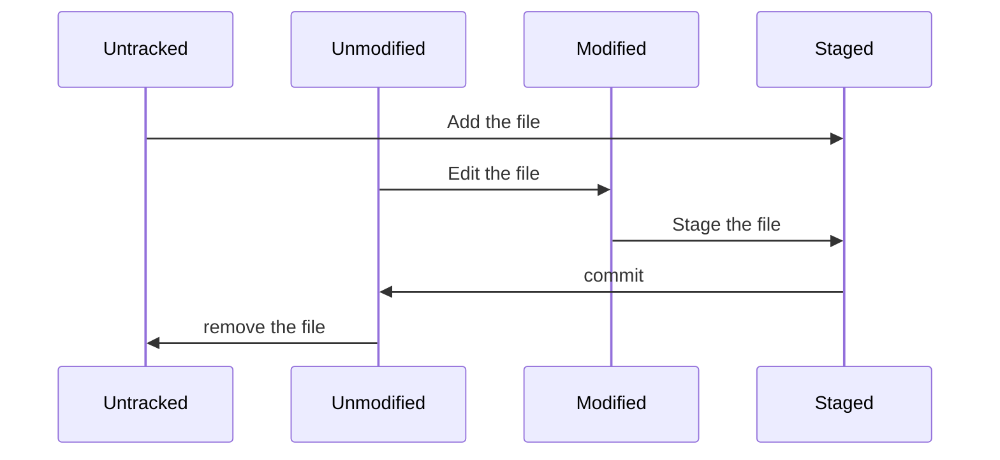
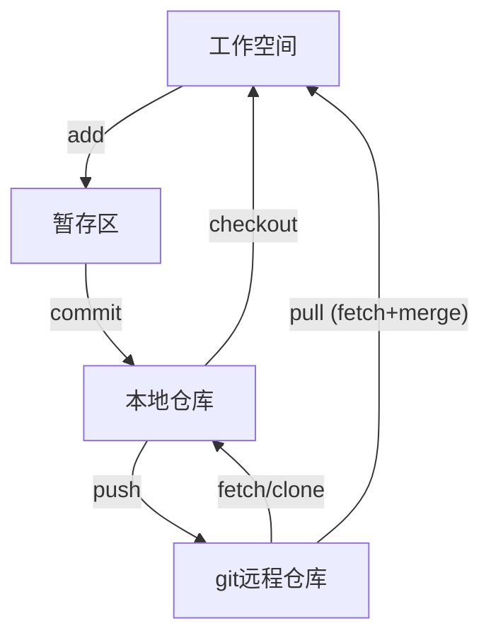

## 1  目录

- [目录](#目录)
- [0 帮助手册](#0-帮助手册)
- [1 概念](#1-概念)
- [2 安装](#2-安装)
- [3 配置](#3-配置)
  - [3.1 查看配置](#31-查看配置)
  - [3.2 配置姓名和邮箱](#32-配置姓名和邮箱)
- [4 帮助](#4-帮助)
- [4 获取 git 仓库](#4-获取-git-仓库)
  - [4.1初始化本地](#41初始化本地)
  - [4.2 克隆现有仓库](#42-克隆现有仓库)
- [５ 更新记录到仓库](#５-更新记录到仓库)
  - [5.1 理论基础](#51-理论基础)
  - [5.2 跟踪或暂存文件](#52-跟踪或暂存文件)
  - [5.3 查看文件相关信息](#53-查看文件相关信息)
	- [(1) `git status`](#1-git-status)
	- [(2) `git diff`](#2-git-diff)
  - [5.4 提交更新](#54-提交更新)
  - [5.5 移除文件](#55-移除文件)
  - [5.6 移动文件](#56-移动文件)
  - [5.7 查看提交历史](#57-查看提交历史)
  - [3 简单的使用流程](#3-简单的使用流程)
  - [4.3. index 文件操作](#43-index-文件操作)
  - [4.4. 本地仓库操作](#44-本地仓库操作)
  - [4.5 远程仓库操作](#45-远程仓库操作)
	- [4.5.1 密钥配置](#451-密钥配置)
	- [4.5.2 添加远程仓库](#452-添加远程仓库)
	- [4.5.3 查看版本库连接的远程库](#453-查看版本库连接的远程库)
	- [4.5.4 获取远程仓库内容——更新操作`fetch`——推荐操作](#454-获取远程仓库内容更新操作fetch推荐操作)
	- [4.5.5 pull](#455-pull)
	- [4.5.6 push](#456-push)
  - [4.6. 分支(branch)](#46-分支branch)
  - [4.7. 标签(tag)](#47-标签tag)
- [5. 遇到问题](#5-遇到问题)

### 1.1  帮助手册

使用帮助手册：

- [archlinux git wiki](https://wiki.archlinuxcn.org/wiki/Git#%E9%85%8D%E7%BD%AE)
- [git帮助手册](https://git-scm.com/book/zh/v2/%e8%b5%b7%e6%ad%a5-%e5%85%b3%e4%ba%8e%e7%89%88%e6%9c%ac%e6%8e%a7%e5%88%b6)

### 1.2  概念

git 是**版本控制**的工具

版本控制：一种在开发过程中，用于管理我们对文件、目录、工程的修改历史，方便查看更改历史记录，备份以恢复历史版本的软件工程技术。

> 因为有版本迭代，所以要版本控制

版本控制分类:

1. **本地版本控制**：对每个文件做一个版本快照，或记录补丁文件，适合个人使用，如 RCS
2. **集中式版本控制**: 所有版本数据放在服务器上，协同开发者从服务器上同步更新或上传修改, 如 **SVN**
   1. 所有版本都在服务器上，每个用户只有自己本地的历史版本，断网状态的时候，无法切换分支，无法同步最新版本
   2. 所有的版本数据存储在同一服务器上，有单点故障的风险
3. **分布式版本控制**: 将所有版本信息仓库同步到本地的每一个用户，解决了集中式版本控制的两个问题，如 **Git**
   1. 所有版本信息仓库都同步到本地每一个用户，有信息泄漏等安全隐患
   2. 增加本地存储空间的占用

### 1.3  安装

```shell
sudo pacman -S git

1+x2 2(1-x2)
```

### 1.4  配置

#### 1.4.1  配置文件

Git 的配置文件都存储在本地，共有 4 种 `ini` 类型的配置文件：

1. 系统默认配置文件: `/etc/gitconfig`
2. 用户的配置文件:
   1. `~/.gitconfig`
   2. `~/.config/git/config`
3. 仓库的配置文件: `.git/config`

这些文件可以直接编辑，但是更常用的方法是使用 `git config` 命令。

#### 1.4.2  查看配置

```shell
# 查看 git 配置
git config [{--local,--global,--system}] {-l,--list} [--show-origin]　[参数]
```

- `{--local,--global,--system}`: 限制了`git config`命令的作用域，分别对应`{本地，用户，系统}`
- `{-l,-list}`: 将符合条件的配置信息列出
- `--show-origin`: 列出所有配置以及它们所在文件。
- `[参数]`: 如果设置了参数，则 `git config` 的结果会显示该参数的值。参数和`-l`只能同时出现一个

```shell
# 列出所有配置
git config -l
# 列出系统默认配置
git config --system --list
# 列出用户配置
git config --global --list
# 列出所有配置，并显示配置所在文件夹
git config -l --show-origin
# 列出用户名的属性值，并显示该配置所在文件夹爱
git config --show-origin user.name
```

#### 1.4.3  配置姓名和邮箱

```shell
git config --global user.name "用户名"
git config --global user.email 邮箱地址
```

- `--global`: 全局的配置，是配置一次之后，全局都会使用该信息。如果想要对特定项目配置不同的用户名称和邮箱，则在项目目录下，使用没有`--global`选项的命令

### 1.5  理论基础

#### 1.5.1  文件状态

工作空间，也就是本地的项目目录。

工作空间中，文件的状态主要分为两种：

- 未跟踪：工作空间中除了已跟踪外的文件都属于未跟踪文件：`Untracked`
- 已跟踪：被纳入到 git 版本控制的文件，包含:
	- `Unmodified`；
	- `modified`;
	- `Staged`。



> 1. 未跟踪文件可以通过 `git add` 操作，将其加入到已跟踪文件中，且其状态为 `Staged`。
> 2. 初次克隆的仓库，其工作目录中所有的文件都属于已跟踪文件，且其状态为 `Unmodified`。
> 3. 对工作目录中已跟踪文件编辑后，被编辑文件会被 `Git` 标记为 `Modified`。
> 4. 对于放到暂存区内的文件，`Git`　将其标记为 `Staged`

#### 1.5.2  简单流程



### 1.6  创建 git 仓库

#### 1.6.1  初始化

```shell
git init

# 初始化本地分支
git config --global init.defaultBranch <name>
```

- name：通常是`master`或者`main`

#### 1.6.2  克隆现有仓库

```shell
git clone <repository>　[本地仓库名]
```

#### 1.6.3  配置密钥

##### 7.3.1. 生成密钥

```shell
ssh-keygen -t rsa -f Path/FileName  -C <"注册的邮箱">
```

- `-t`：指定模式为`rsa`
		- `-f`：指定输出文件名称和位置，可省略。
			- 默认生成`id_rsa`和`id_rsa.pub`
		- `-C`：指定邮箱

	>　无论上`windows`，还是`linux`，文件都会生成在用户目录下的`.ssh`文件夹下

##### 7.3.2. 账户添加公钥

 1. 复制文件夹中的`id_rsa.pub`中的内容
 2. 粘贴到 GitHub 中的`SSH keys`中

> 名字随便取，但`key`，直接源码复制粘贴，不能修改任何地方

#### 1.6.4  添加远程仓库

默认远程库的名字为`origin`，可以修改

```shell
git remote add origin <url>
```

- `url`：一般是`git@github.com:username/reponame.git`

### 1.7  提交三步骤

#### 1.7.1  将文件加载到暂存区

作用：

1. 跟踪新文件
2. 把已跟踪的文件放到暂存区
3. 用于合并时把有冲突的文件标记为已解决状态等

> 对于未跟踪(Untracked)文件和已修改(Modified)文件，需要使用 `git add` 命令将文件加载到暂存区

语法：

```shell
git add 参数
```

参数：

- 可以是文件、目录或`glob`模式
- 通常是`.`，也就是将当前目录内所有文件

#### 1.7.2  提交到本地仓库

作用：

将 `Staged` 状态的文件提交到 Git 仓库。(文件状态也就转为 `Unmodified`)

语法：

```shell
git commit [options]

git commit -m '注释'
```

`[options]`：

- `-m`: massage，对此处提交进行备注。使用此选项便不必编写 commit 命令文件。
- `-a`: 跳过暂存区，将所有已经跟踪的文件暂存起来一并提交，从而跳过 `git add` 步骤
- `--amend`：重做上次提交

> `git commit` 只提交已暂存(`Staged`)的修改，对于未暂存的修改不会提交。因此，在每次提交前，尽量使用　`git status`　确认要提交的内容。

#### 1.7.3  push

```shell
git push [-u] [-f] origin main

# 初次使用时，可以使用`-u`，将地址记录下来，以后就使用 `git push` 即可
git push -u origin main

# 使用`-f`可以强制`push`文件到远程仓库
git push -f origin main
```

##### 远程仓库已存在文件（如 README）

若远程仓库非空（例如初始化时勾选了 Add a README），需先拉取并合并：

```bash
git pull origin main --allow-unrelated-histories

# 初次拉取
git push -u origin main
```

##### 分支名称冲突

如果本地分支名与远程不同，可重命名本地分支：

```bash
git branch -m 旧分支名 新分支名
```

##### 权限错误

- HTTPS 协议：确保输入了正确的账号密码（或配置了 Git 凭证存储）。
- SSH 协议：检查 SSH 密钥是否已添加到 GitHub/GitLab 等平台。

#### 1.7.4  移除文件

从 git 中移除文件，就是将文件从已跟踪名单中移除，然后提交。

从已跟踪名单中移除，就是将文件状态从 `Unmodified` 修改为 `Untracked`。

语法：

```shell
git rm [options] 参数
```

`[options]`：

- 无: 将文件从仓库中删除
- `-f`: 将文件从仓库中删除
- `--cached`: 将文件从跟踪名单中移除

参数：

- 参数可以是文件、目录或 `glob` 模式

具体命令：

```shell
# 将从工作区删除后，提交该删除操作
rm 文件 # 1 删除文件
git rm 文件 # 2 记录删除操作

# 在移除 modified 状态和 staged 状态的文件时，需要设置 options `-f`，强制删除
git rm -f 文件

# 将文件从暂存区域移除，但仍然保留工作空间的文件
git rm --cached 文件
```

#### 1.7.5  移动文件

作用: 对文件的重命名，将文件从 `file_from` 名字修改为了 `file_to`。

语法:

```shell
git mv file_from file_to
```

> 表面上只是一次重命名操作，但本质上是隐性的文件移动操作。
> `git mv`相当于执行了三步操作：
>
> ```shell
>   # 1. 工作目录中的文件重命名操作
>   mv file_from file_to
>   # 2. 将旧文件从已跟踪名单中移除
>   git rm file_from
>   # 3. 将新文件添加到已跟踪名单中
>   git add file_to
> ```

#### 1.7.6  查看提交历史

作用：查看提交历史

网址: [git log 的帮助手册](https://git-scm.com/book/zh/v2/Git-%e5%9f%ba%e7%a1%80-%e6%9f%a5%e7%9c%8b%e6%8f%90%e4%ba%a4%e5%8e%86%e5%8f%b2)

语法：

```shell
git log [options]
```

> 不传入任何参数的默认情况下，git log 会按时间先后顺序列出所有的提交，最近的更新排在最上面。

常用选项：

- `{-p,--patch}`: 显示每次提交时的差异。
- `{-n}`: 限制显示日志条目数
- `--stat`: 显示每次提交的简略统计信息
- `--shortstat`: 只显示 --stat 中最后的行数修改添加移除统计。
- `--name-status`: 显示新增、修改、删除的文件清单。
- `--abbrev-commit`: 仅显示 SHA-1 校验和所有 40 个字符中的前几个字符。
- `--relative-date`: 使用较短的相对时间而不是完整格式显示日期（比如“2 weeks ago”）。
- `--graph`: 在日志旁以 ASCII 图形显示分支与合并历史。
- `--oneline`: `--pretty=oneline --abbrev-commit` 合用的简写。
- `--pretty`: 定制格式

  ```shell
  # 消息的详细程度
  --pretty = short
  --pretty = full
  --pretty = fuller

  # 消息显示在一行
  --pretty = oneline

  # 格式化展示消息
  # 常用选项请查帮助手册
  --pretty = format:"%h - %an, %ar : %s"
  ```

限制长度的常用选项

- `-<n>`: 仅显示最近的 n 条提交。
- `--since, --after`: 仅显示指定时间之后的提交。
- `--until, --before`: 仅显示指定时间之前的提交。
- `--author`: 仅显示作者匹配指定字符串的提交。
- `--committer`: 仅显示提交者匹配指定字符串的提交。
- `--grep`: 仅显示提交说明中包含指定字符串的提交。
- `-S`: 仅显示添加或删除内容匹配指定字符串的提交。

#### 1.7.7  index 文件操作

3. 更新文件到index -- 重点！！！

	```shell
    git add <pathspec>
    ```

	通常 `git add .`

4. 撤销修改

	```shell
    git reset <pathspec>
    ```

5. 删除文件从working tree 和 index

	```shell
    git rm <pathspec>
    ```

6. 移动重命名文件

	```shell
    git mv <pathspec>
    ```

7. 查看修改

	```shell
    git status
    ```

8. 重新存储working tree

	```shell
    git restore
    ```

9. 设置版本号 -- 重点！！！

	```shell
    git add LICENSE
    ```

### 1.8  remote

#### 1.8.1  变量

`url`

```shell
## git
git@github.com:<username>/<reponame>.git
```

- `username`：github帐号名称
- `reponame`：仓库名称

#### 1.8.2  方法

查看版本库连接的远程库

```shell
git remote -v
```

添加远程仓库

```shell
git remote add origin <url>

git remote add origin git@github.com:reponame.git
```

移除远程仓库

```shell
git remote remove origin

git remote remove origin
```

修改远程仓库

```shell
git remote set-url origin <url>
```

### 1.9  pull

> 相当于`git fetch` 后加上 `git merge FETCH_HEAD`

```shell
    git pull <label>
```

等价于

```c++
 git fetch
 git log --graph --oneline origin/main <mybranch>
 git merge origin/main
 # 或者
 git rebase origin/main
```

> 更推荐`git fetch`，可以保持程序员对更新操作的控制

### 1.10  查看文件相关信息

#### 1.10.1  (1) `git status`

作用: 查看文件状态

语法：

```shell
git status [options]
```

`[options]`:

- `{-s,--short}`: 简洁输出

#### 1.10.2  (2) `git diff`

作用: 查看文件的具体修改内容

具体命令：

```shell
# 查看未暂存的变化内容。
# 也就是，比对工作目录中当前文件和暂存区域快照之间的差异。
git diff
# 查看已暂存的将要添加到下次提交里的内容
# 也就是，比对已暂存文件和最后一次提交的文件之间的差异。
git diff　--staged
# 查看已经暂存的变化
git diff --cached
# 更详细
git diff -v
```

> 只显示尚未暂存的改动

### 1.11  分支(branch)

分支类似于仓库中的隔间，当我们想对项目的某一方面作出一些尝试，但不想这个尝试会影响到项目时，可以创建一个分支并将更改文件保存在这个分支中。如果后续想要将这一部分融入到项目中时，那就将这个分支融入到主分支即可。

10. 创建分支

	```shell
    git branch <分支名>
    ```

	仓库初始化后需要指定主分支，也就是第一次创建分支，

	需要使用参数`-M`

	```shell
    git branch -M main
    ```

11. 查看分支

	```shell
    git branch
    ```

12. 切换分支

	```shell
    git checkout <分支名>
    ```

	> 新建并却换分支
>
	> ```shell
    > git checkout -b <分支名>
    > ```

13. 合并分支
	合并时，需要将分支切换为主分支，再进行合并

	```shell
    git checkout <主分支名>
    git merge <分支名>
    ```

	**合并撤回**:使用`--abort`命令

	```shell
    git merge --abort
    ```

	或

	```shell
    git pull --abort
    ```

14. 删除分支

	```shell
    git branch -d branch
    ```

question: 合并时的冲突问题

answer: 手工介入，进入到相应文件进行修改

### 1.12  标签(tag)

发布一个版本时，通常先在版本库打一个标签(tag)，代表这个版本。标签指向打标签时的仓库的快照，取某个标签，也就是将那个标签对应的历史版本取出。

15. 创建标签

	```shell
    git tag <标签名，比如v1.0>
    ```

	**创建历史状态的标签**
	查询出历史提交的commit id，对其打上标签

	```shell
    git log --pretty=oneline --abbrev-commit
    git tag <标签名> <commit id>
    ```

16. 查看标签

	```shell
    git tag
    ```

17. 删除标签

	```shell
    git tag -d <标签名>
    ```

	删除远程标签

	```shell
    git push origin :refs/tags/<标签名>
    ```

18. 推送标签

	```shell
    git push origin <标签名>
    ```

	推送全部标签

	```shell
    git push origin --tags
    ```

19. 指定标签信息

	```shell
    git tag -a <tagname> -m "<标签信息>"
    ```

### 1.13  命令

#### 1.13.1  git diff

用以比较文件和目录之间的差别

查看工作取和

查看分支之间的区别

```shell
git diff branch1 branch2
```

### 1.14  git status

作用：查看修改的状态

语法

```shell
git status
```

### 1.15  git log

作用：查看提交日志

```shell
git log [options]
```

options

- `--all`：显示所有分支
- `--pretty=oneline`：将提交信息显示为一行
- `--abbrev-commit`：使得输出的commitID更简短
- `--graph`：以图的形式显示

常用

```shell
git log --abbrev-commit --pretty=oneline --all --graph
```

### 1.16  遇到问题

#### 1.16.1  本地分支比远程分支版本落后，不允许更新

解决方案：先拉再推

20. 拉取内容到本地

```shell
git fetch origin main # 默认别名为 FETCH_HEAD

git fetch orgin main:别名
```

21. 查看分支之间的区别

```shell
git fetch 别名
```

```shell

	git fetch origin main

	git log FETCH_HEAD

	git merge FETCH_HEAD

    git push origin main
   ```

>[!bug]

### 1.17  帮助

```shell
git help options
git options --help
man git-options
```

比如，想要获取`git config`的帮助手册

```shell
git help config
git config --help
man git-config
```

> 用 `-h` 而不是 `--help`，可以获得简略版帮助手册
